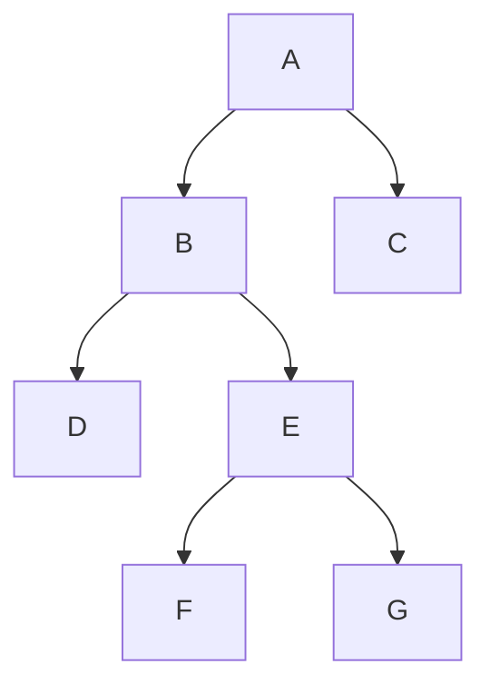
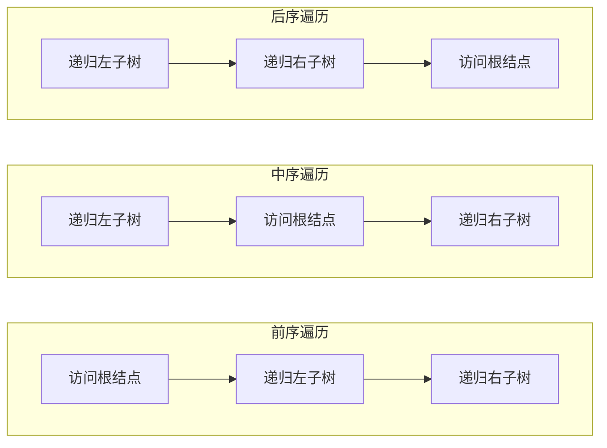

> 前置依赖：二叉树的基础定义、存储结构（二叉链表）
> 
> 核心目标：将二叉树的非线性结构，转换为可线性访问的结点序列，是所有二叉树操作的基础

---

### 📌 核心定义：什么是二叉树的遍历？

**二叉树遍历**是指：按照指定的顺序，对树中所有结点进行**有且仅有一次**的访问，核心是将非线性的树结构，转换为线性的结点序列。

- 线性表的遍历：顺序固定，每个结点仅有一个前驱和后继，仅需正向 / 反向循环即可。
- 二叉树的遍历：非线性结构，每个结点最多有两个后继，遍历顺序不固定，需约定访问规则，主流分为两大类：
    
    1. **广度优先遍历（BFS）**：即层序遍历，按「从上到下、逐层从左到右」的顺序访问。
    2. **深度优先遍历（DFS）**：按「先深度、后广度」的顺序访问，根据**根结点的访问时机**，分为前序、中序、后序三种。
    

---

### 🔑 标准测试用例（全遍历验证用）

本笔记所有遍历均基于以下固定二叉树，可直接输入代码运行验证，四种遍历结果完全可区分。

plaintext

```cpp
7
A
B A 0
C A 1
D B 0
E B 1
F E 0
G E 1
```

#### 对应二叉树结构



#### 四种遍历标准结果（对照验证用）

|遍历类型|标准输出序列|
|:--|:--|
|层序遍历（BFS）|`A B C D E F G`|
|前序遍历（根→左→右）|`A B D E F G C`|
|中序遍历（左→根→右）|`D B F E G A C`|
|后序遍历（左→右→根）|`D F G E B C A`|

---

### 🌐 一、广度优先遍历（层序遍历 BFS）

#### 核心原理

从根结点开始，**从上到下逐层遍历，每层内严格按照从左到右的顺序访问**，核心借助 ** 队列「先进先出」** 的特性实现：

1. 根结点入队，启动遍历
2. 循环：队列非空时，取出队首结点访问，将其左、右孩子依次入队
3. 队列为空时，遍历结束

#### 代码实现（C++ 面向对象工程化）

> 设计哲学：**接口与实现分离**，对外接口负责边界合法性校验、用户友好提示；内部辅助函数专注核心算法实现，职责清晰、可复用性强。

```cpp
// 对外层序遍历接口
// 常量成员函数：不修改树结构，仅做遍历访问
void levelOrderTraverse(void) const
{
    if (root == nullptr) {
        cout << "Level Order Traversal: Tree is empty." << endl;
        return;
    }
    cout << "Level Order (BFS) Traversal: ";
    // 非空树 → 调用辅助函数执行层序遍历
    levelOrderHelper(root);
    cout << endl;
}

// 层序遍历（广度优先 BFS）核心辅助实现（迭代实现）
// 语义：const BTree root 不修改指针本身的指向；函数尾部 const 不修改树结构
void levelOrderHelper(const BTree root) const
{
    // 队列存储结点常量指针，保证遍历过程不修改任何结点数据
    queue<const BTNode*> q;
    // 根结点入队，启动层序遍历
    q.push(root);

    // 队列不为空，说明还有结点未遍历
    while (!q.empty()) {
        // 取出队首结点（当前层最左侧结点）
        const BTNode* cur = q.front();
        q.pop();

        // 访问当前结点：输出结点数据
        cout << cur->data << " ";

        // 左孩子优先入队，保证遍历顺序严格“从左到右”
        if (cur->l != nullptr) q.push(cur->l);
        // 右孩子随后入队
        if (cur->r != nullptr) q.push(cur->r);
    }
}
```

---

### 🔍 二、深度优先遍历（DFS）

#### 核心原理

沿着树的深度优先访问，先走到叶子结点再回溯，基于**二叉树的递归特性**实现，核心差异仅在于**根结点的访问时机**。

> ⚠️ 核心考点：三种深度遍历的**递归实现代码结构完全一致，仅根结点的访问代码（cout 行）的位置不同**，仅一行代码的位置差异，决定了完全不同的遍历序列。

#### 三种深度遍历访问顺序横向对比



---

#### 1. 前序遍历（根→左→右）

##### 代码实现（递归实现）

> 设计哲学：与层序遍历一致，接口与实现分离，接口负责边界校验与友好提示，辅助函数专注核心递归算法。

```cpp
// 对外前序遍历接口
void preOrderTraverse(void) const 
{
    // 边界判断：空树直接提示返回，避免无效递归调用
    if (root == nullptr) {
        cout << "Pre-Order Traversal: Tree is empty." << endl;
        return;
    }
    cout << "Pre-Order Traversal: ";
    // 非空树 → 调用递归辅助函数执行前序遍历
    preOrderHelper(root);
    cout << endl;
}

// 前序遍历（根→左→右）递归辅助实现
// 语义：const BTree root 不修改指针指向；函数尾部 const 不修改树结构
void preOrderHelper(const BTree root) const 
{
    // 递归出口：当前结点为空，直接返回
    if (root == nullptr) {
        return;
    }
    // 访问当前根结点（前序核心：根优先访问）
    cout << root->data << " ";
    // 递归遍历左子树
    preOrderHelper(root->l);
    // 递归遍历右子树
    preOrderHelper(root->r);
}
```

---

#### 2. 中序遍历（左→根→右）

##### 代码实现（递归实现）

> 设计哲学：同层序遍历

```cpp
// 对外中序遍历接口
void inOrderTraverse(void) const
{
    if (root == nullptr) {
        cout << "In-Order Traversal: Tree is empty." << endl;
        return;
    }
    cout << "In-Order Traversal: ";
    inOrderHelper(root);
    cout << endl;
}

// 中序遍历（左→根→右）递归辅助实现
void inOrderHelper(const BTree root) const
{
    // 递归出口：当前结点为空，直接返回
    if (root == nullptr) {
        return;
    }
    // 递归遍历左子树
    inOrderHelper(root->l);
    // 访问当前根结点（中序核心：左遍历完成后访问根）
    cout << root->data << " ";
    // 递归遍历右子树
    inOrderHelper(root->r);
}
```

---

#### 3. 后序遍历（左→右→根）

##### 代码实现（递归实现）

> 设计哲学：同层序遍历

```cpp
// 对外后序遍历接口
void postOrderTraverse(void) const
{
    if (root == nullptr) {
        cout << "Post-Order Traversal: Tree is empty." << endl;
        return;
    }
    cout << "Post-Order Traversal: ";
    postOrderHelper(root);
    cout << endl;
}

// 后序遍历（左→右→根）递归辅助实现
void postOrderHelper(const BTree root) const
{
    // 递归出口：当前结点为空，直接返回
    if (root == nullptr) {
        return;
    }
    // 递归遍历左子树
    postOrderHelper(root->l);
    // 递归遍历右子树
    postOrderHelper(root->r);
    // 访问当前根结点（后序核心：左右子树遍历完成后访问根）
    cout << root->data << " ";
}
```

---

#### 三种深度遍历递归代码核心差异对比

|遍历类型|代码执行顺序|核心差异（cout 行位置）|
|:--|:--|:--|
|前序遍历|根 → 左 → 右|递归左、右子树**之前**访问根结点|
|中序遍历|左 → 根 → 右|递归左子树**之后**、递归右子树**之前**访问根结点|
|后序遍历|左 → 右 → 根|递归左、右子树**之后**访问根结点|

### 🔍 三、深度优先遍历（DFS）非递归实现（迭代法）

#### 核心原理

递归遍历的本质是编译器自动维护函数调用栈，非递归遍历的核心是**手动用栈模拟递归的调用与回溯过程**，完全复刻递归的访问顺序，消除极端深度树的递归栈溢出风险，更贴合计算机底层执行逻辑。

> ⚠️ 核心考点：三种非递归遍历的核心差异，与递归完全一致 ——**根结点的访问时机不同**；前序 / 中序非递归代码仅一行访问语句的位置差异，后序需额外处理右子树的访问标记。
> 
> 📌 核心结论（图片内容）：**前序遍历序列 = 结点的入栈顺序；中序遍历序列 = 结点的出栈顺序**；入栈顺序固定时，合法出栈顺序的总数 = 卡特兰数，对应「先序序列固定时，可生成的二叉树总数」。

#### 循环遍历通用框架（三种遍历通用）

所有非递归深度遍历，均遵循统一的循环启动条件：`while (当前结点指针非空 || 栈非空)`

- 指针非空：说明还有未访问的左子树，继续向左深入
- 栈非空：说明还有未回溯处理的根结点 / 右子树，继续弹出回溯

---

#### 1. 前序遍历（根→左→右）非递归实现

##### 核心执行逻辑（对应图片内容）

1. 初始化当前指针`cur`指向根结点，创建空栈
2. 循环：`cur`非空 **或** 栈非空时持续执行
    
    - 若`cur`非空：**先访问当前根结点**，将结点入栈，`cur`指向其左孩子（优先遍历左子树）
    - 若`cur`为空：说明当前结点的左子树已遍历完成，弹出栈顶结点，`cur`指向栈顶结点的右孩子，遍历右子树
    

##### 工程化代码实现（C++ 面向对象，与递归版接口统一）

```cpp
// 对外前序遍历（非递归）接口
// 常量成员函数：不修改树结构，仅做遍历访问
void PreOrderTraverse() const {
    if (!root_) {
        std::cout << "Pre-Order Traversal: Tree is empty." << std::endl;
        return;
    }
    std::cout << "Pre-Order Traversal: ";
    PreOrderHelper();
    std::cout << std::endl;
}

// 前序遍历非递归核心辅助实现
// 前序访问顺序 = 结点入栈顺序
void PreOrderHelper() const noexcept {
    std::stack<Node*> s;
    Node* cur = root_; // 初始化当前遍历指针，指向根结点

    // 通用循环框架：指针非空 或 栈非空，说明还有结点未访问
    while (cur || !s.empty()) {
        if (cur) {
            // 前序核心：先访问根结点，再入栈、遍历左子树
            std::cout << cur->data << ' ';
            s.push(cur);       // 入栈保存结点，用于后续回溯访问右子树
            cur = cur->left;   // 继续深入左子树
        } else {
            // 左子树遍历完成，回溯弹出栈顶结点，访问右子树
            cur = s.top()->right;
            s.pop();
        }
    }
}
```

---

#### 2. 中序遍历（左→根→右）非递归实现

##### 核心执行逻辑（对应图片内容）

1. 初始化当前指针`cur`指向根结点，创建空栈
2. 循环：`cur`非空 **或** 栈非空时持续执行
    
    - 若`cur`非空：将结点入栈，`cur`指向其左孩子（优先遍历左子树，暂不访问根）
    - 若`cur`为空：说明当前结点的左子树已遍历完成，**弹出栈顶结点并访问**，`cur`指向栈顶结点的右孩子，遍历右子树
    

##### 工程化代码实现（C++ 面向对象，与递归版接口统一）

```cpp
// 对外中序遍历（非递归）接口
void InOrderTraverse() const {
    if (!root_) {
        std::cout << "In-Order Traversal: Tree is empty." << std::endl;
        return;
    }
    std::cout << "In-Order Traversal: ";
    InOrderHelper();
    std::cout << std::endl;
}

// 中序遍历非递归核心辅助实现
// 中序访问顺序 = 结点出栈顺序
void InOrderHelper() const noexcept {
    std::stack<Node*> s;
    Node* cur = root_;

    while (cur || !s.empty()) {
        if (cur) {
            // 中序核心：先入栈遍历左子树，左子树遍历完成后再访问根
            s.push(cur);
            cur = cur->left;
        } else {
            // 左子树遍历完成，弹出栈顶根结点，访问后遍历右子树
            std::cout << s.top()->data << ' ';
            cur = s.top()->right;
            s.pop();
        }
    }
}
```

---

#### 3. 后序遍历（左→右→根）非递归实现

##### 核心执行逻辑（对应图片内容）

后序遍历的核心难点：弹出栈顶结点时，无法确定其右子树是否已经遍历完成，因此需要**额外的`pre`指针，记录上一个刚刚访问过的结点**，通过对比`pre`与栈顶结点的右孩子，判断右子树是否遍历完成。

1. 初始化当前指针`cur`指向根结点，创建空栈，`pre`指针初始化为`nullptr`
2. 循环：`cur`非空 **或** 栈非空时持续执行
    
    - 若`cur`非空：将结点入栈，`cur`指向其左孩子（优先遍历左子树）
    - 若`cur`为空：取栈顶结点，做如下判断
        
        - 若栈顶结点**无右孩子**，或**右孩子就是上一个访问的结点`pre`**：说明左右子树均已遍历完成，访问栈顶结点，更新`pre`为当前访问的结点，弹出栈顶结点
        - 否则：说明右子树未遍历，`cur`指向栈顶结点的右孩子，继续遍历右子树
        
    

##### 工程化代码实现（C++ 面向对象，与递归版接口统一）

```cpp
// 对外后序遍历（非递归）接口
void PostOrderTraverse() const {
    if (!root_) {
        std::cout << "Post-Order Traversal: Tree is empty." << std::endl;
        return;
    }
    std::cout << "Post-Order Traversal: ";
    PostOrderHelper();
    std::cout << std::endl;
}

// 后序遍历非递归核心辅助实现
void PostOrderHelper() const noexcept {
    std::stack<Node*> s;
    Node* cur = root_;
    Node* pre = nullptr; // 记录上一个已访问的结点，用于判断右子树是否遍历完成

    while (cur || !s.empty()) {
        if (cur) {
            // 后序核心：先入栈遍历左子树，暂不访问根
            s.push(cur);
            cur = cur->left;
        } else {
            Node* top_node = s.top();
            // 判断：右子树不存在，或右子树已经遍历完成
            if (!top_node->right || pre == top_node->right) {
                // 左右子树均遍历完成，访问根结点
                std::cout << top_node->data << ' ';
                pre = top_node; // 更新pre为当前访问的结点
                s.pop();        // 弹出已访问完成的结点
            } else {
                // 右子树未遍历，转向右子树
                cur = top_node->right;
            }
        }
    }
}
```

---

## 📍 补充考点：先序序列固定时，二叉树的总数（卡特兰数）

### 🔑 核心原理

先序遍历序列对应结点的**入栈顺序**，中序遍历序列对应结点的**出栈顺序**；当入栈顺序固定时，所有合法的出栈顺序总数 = 第 n 个卡特兰数，而每一个合法的出栈顺序（中序序列），都对应唯一的一棵二叉树。

因此：**长度为 n 的先序遍历序列，可生成的不同二叉树的总数 = 第 n 个卡特兰数**。

---

## 📌 非递归遍历核心应用知识

1. **栈的核心特性应用**：利用栈「先进后出（LIFO）」的特性，完美模拟递归函数的调用与回溯过程，实现了非线性树结构的线性化遍历。
2. **const 正确性工程规范**：所有遍历函数均声明为`const`成员函数，保证遍历过程中不会修改二叉树的任何结点数据，符合只读操作的语义规范。
3. **接口与实现分离设计**：对外接口仅负责边界合法性校验、用户友好提示，内部辅助函数专注核心算法逻辑，职责清晰，可复用性、可维护性极强。
4. **异常安全与边界处理**：空树场景提前判断并友好提示，避免无效的栈操作与空指针访问，保证代码的鲁棒性。
5. **noexcept 异常规范**：核心辅助函数声明为`noexcept`，明确告知编译器该函数不会抛出异常，便于编译器优化，同时符合 C++ 工程化异常规范。

---

## 🔎 扩展问题与延伸知识

1. **递归与非递归遍历的核心差异**
    
    - 递归遍历：代码简洁、可读性强，依赖编译器的函数调用栈，极端场景（如深度过万的斜树）会出现栈溢出。
    - 非递归遍历：手动维护栈，栈空间在堆上分配，可处理极深的树，无栈溢出风险，执行效率更高，是工程中更推荐的实现方式。
    
2. **遍历序列的唯一性考点延伸**
    
    前序 + 中序、后序 + 中序、层序 + 中序可唯一还原二叉树，本质是因为中序序列能唯一拆分左右子树的边界；而前序 + 后序无法唯一还原，是因为无法区分单孩子是左孩子还是右孩子。 
    
3. **线索二叉树的延伸**
    
    二叉树遍历的核心痛点是遍历完成后，无法直接找到结点的前驱和后继；线索二叉树通过利用二叉树的空指针域，存储结点的遍历前驱和后继，实现了无需栈 / 递归的线性遍历，是遍历算法的重要延伸。

---

### 💡 个人核心思考总结：

二叉树遍历的本质是**结点查询遍历 与 实际访问操作完全分离**✅；

前序、中序非递归实现逻辑简洁，该特性体现较弱；

而后序遍历的非递归实现📚，通过 **pre** 标记指针划分遍历阶段，严格拆分「查找遍历结点」和「满足条件后再访问结点」两大流程，**最直观、最完整地体现查询与访问分离的核心设计思想**。

---

### ✍️ 四、如何手写深度遍历的输出顺序（递归括号填坑法）

针对考研选择题中 “给定二叉树结构，快速写出遍历序列” 的需求，可使用**递归括号填坑法**，100% 准确无错，核心步骤如下：

#### 核心规则

先为每种遍历定义固定的括号框架，**括号内的顺序就是该遍历的访问顺序**：

- 前序遍历框架：`( 根 左子树 右子树 )`
- 中序遍历框架：`( 左子树 根 右子树 )`
- 后序遍历框架：`( 左子树 右子树 根 )`

#### 分步操作（以中序遍历为例，标准测试用例）

1. **初始化根结点框架**：从根结点 A 开始，套入中序框架 `( 左子树 A 右子树 )`
2. **递归填充子树**：把每个子树的根结点继续套入对应框架，直到叶子结点（叶子结点的左右子树为空，直接填根）
    
    - A 的左子树是 B，填充后：`( ( 左子树 B 右子树 ) A 右子树 )`
    - B 的左子树是 D（叶子），右子树是 E，填充后：`( ( ( D ) B ( 左子树 E 右子树 ) ) A 右子树 )`
    - E 的左子树是 F（叶子），右子树是 G（叶子），填充后：`( ( ( D ) B ( ( F ) E ( G ) ) ) A 右子树 )`
    - A 的右子树是 C（叶子），最终填充完成：`( ( ( D ) B ( ( F ) E ( G ) ) ) A ( C ) )`
    
3. **去掉所有括号**，得到中序遍历序列：`D B F E G A C`，和标准结果完全一致。

#### 关键技巧

- 叶子结点的左右子树为空，直接写为`( 结点 )`即可，无需再拆分。
- 前序 / 后序仅需更换框架顺序，填充逻辑完全一致，可快速写出对应序列。

---

## 🎯 五、考研（408）核心考点与考法

>📍 考研 408 二叉树还原：3 种核心组合解题模板 

#### ⚠️ 选择题秒杀第一准则（先记死）

唯一还原二叉树，**必须且仅需「中序序列 + 另外任意一种遍历序列（前 / 后 / 层序）」**

仅给出「前序 + 后序」，无法唯一确定二叉树结构（选择题高频错误坑，直接排除）

---

#### 💡 通用标准测试用例（所有例题统一）

对应二叉树结构：

```
        A
      /   \
     B     C
    / \
   D   E
      / \
     F   G
```

四大遍历标准序列：

- 前序（根→左→右）：`A B D E F G C`
- 中序（左→根→右）：`D B F E G A C`
- 后序（左→右→根）：`D F G E B C A`
- 层序（从上到下）：`A B C D E F G`

---

## 📍 组合 1：前序遍历 + 中序遍历（最高频考点）

### 🔑 核心分工

- 前序序列：**找根节点** → 任意子树的根，永远在该子树前序序列的「第一个位置」
- 中序序列：**拆分子树** → 根节点左侧 = 左子树全部结点，右侧 = 右子树全部结点，同时统计左右子树结点数量

### ✅ 标准化 4 步解题法

1. 定根：取当前前序序列第一个元素，为当前子树根节点
2. 拆树：在中序序列找到根，拆分左、右子树结点集合，统计结点数量
3. 切分：按左右子树结点数量，切分前序序列中对应的左、右子树前序子序列
4. 递归：对左、右子树重复上述步骤，直到所有结点挂载完成

### 💡 例题极简演示

已知前序`A B D E F G C`、中序`D B F E G A C`

1. 定根：前序首元素`A`为整树根；中序拆分：左子树 5 个结点`D B F E G`，右子树 1 个结点`C`
2. 切分：前序`A`后，切出左子树前序`B D E F G`，右子树前序`C`
3. 递归：左子树根为前序首元素`B`，继续拆分，最终还原完整二叉树

---

## 📍 组合 2：后序遍历 + 中序遍历（次高频考点）

### 🔑 核心分工（前序的镜像逻辑）

- 后序序列：**找根节点** → 任意子树的根，永远在该子树后序序列的「最后一个位置」
- 中序序列：**拆分子树** → 和前序组合完全一致，拆分左右子树、统计结点数量

### ✅ 标准化 4 步解题法

1. 定根：取当前后序序列最后一个元素，为当前子树根节点
2. 拆树：在中序序列找到根，拆分左、右子树结点集合，统计结点数量
3. 切分：按左右子树结点数量，切分后序序列中对应的左、右子树后序子序列
4. 递归：对左、右子树重复上述步骤，直到所有结点挂载完成

### 💡 例题极简演示

已知后序`D F G E B C A`、中序`D B F E G A C`

1. 定根：后序尾元素`A`为整树根；中序拆分：左子树 5 个结点`D B F E G`，右子树 1 个结点`C`
2. 切分：后序`A`前，切出左子树后序`D F G E B`，右子树后序`C`
3. 递归：左子树根为后序尾元素`B`，继续拆分，最终还原完整二叉树

---

## 📍 组合 3：层序遍历 + 中序遍历（低频必考考点）

### 🔑 核心分工

- 层序序列：**按层级找根** → 整树根在序列最前，后续按「从上到下、从左到右」顺序，依次给出每一层的子树根
- 中序序列：**定父子关系** → 通过结点在中序的位置，判断它属于哪个父节点的左 / 右子树，拆分对应子树范围

### ✅ 标准化 4 步解题法

1. 初始化：取层序序列第一个元素，为整棵树的根节点
2. 拆全树范围：在中序序列找到根，拆分整棵树的左、右子树结点全集
3. 按序挂载：按顺序遍历层序剩余结点，依次完成：
    
    - 判断该结点所属的父节点子树范围
    - 挂载到对应父节点的左 / 右孩子位置
    - 在中序拆分该结点自己的左、右子树范围
    
4. 完成：遍历完所有结点，二叉树还原完成

### 💡 例题极简演示

已知层序`A B C D E F G`、中序`D B F E G A C`

1. 初始化：层序首元素`A`为根；中序拆分左子树全集`D B F E G`，右子树全集`C`
2. 按序挂载：`B`属于`A`的左子树→挂载为 A 的左孩子；`C`属于`A`的右子树→挂载为 A 的右孩子
3. 继续挂载：`D`属于`B`的左子树、`E`属于`B`的右子树；`F`/`G`分别属于`E`的左 / 右子树，完成还原

---

## ⚠️ 核心答疑：为什么没有中序序列，无法唯一还原二叉树？

### 🔑 本质原因

前序、后序、层序序列，**只能确定根节点的位置，无法区分「左子树结点」和「右子树结点」的边界**。只有中序序列能明确拆分根节点的左右子树范围，没有这个边界，就会出现多种符合条件的二叉树结构。

### 💡 考研常考反例

已知：前序序列`A B`，后序序列`B A`

没有中序序列的情况下，会出现**两种完全不同的二叉树**，都符合前序 + 后序的结果：

1. 结构 1：`A`是根，`B`是`A`的**左孩子**
2. 结构 2：`A`是根，`B`是`A`的**右孩子**

这两种结构的前序、后序序列完全一致，但二叉树结构完全不同，因此**没有中序序列，无法唯一确定二叉树**。

---

## ✅ 考研避坑 & 验证技巧

1. 选择题秒杀：只要题目给的两种序列**不含中序**，直接排除「可唯一还原二叉树」的选项
2. 还原后必验证：把还原的二叉树，写出题干给出的两种遍历序列，和题干完全一致才算正确
3. 核心易错点：切分子序列时，**子序列长度必须和中序拆分的左右子树结点数量完全一致**，差 1 个就会全错
4. 镜像速记：前序`根→左→右`逆序 = 后序`右→左→根`，可快速交叉验证根节点定位是否正确

---

### 📊 五、四种遍历的时间与空间复杂度分析

表格

|遍历类型|时间复杂度|空间复杂度|补充说明|
|:--|:--|:--|:--|
|层序遍历（BFS）|O(n)|O(n)|每个结点入队出队各 1 次；最坏情况（完美二叉树最后一层）队列长度为n/2，即O(n)|
|前 / 中 / 后序递归遍历|O(n)|O(h)|每个结点访问 1 次；空间为递归栈的开销，h为树的高度，最坏情况（斜树）h=n，平均情况h=log2​n|
|前 / 中 / 后序非递归遍历|O(n)|O(h)|手动模拟栈，空间开销与递归一致，最坏情况O(n)|

---

### 📝 核心笔记重点

1. 🔴 **核心分类**：二叉树遍历分为广度优先（层序）、深度优先（前 / 中 / 后序）两大类，核心差异是访问顺序的约定。
2. 🔴 **递归核心**：三种深度遍历的递归代码仅根结点的访问位置不同，这是最核心的考点，必须熟记框架。
3. 🔴 **层序核心**：层序遍历的核心是队列，必须掌握入队、出队的顺序，保证从左到右的访问规则。
4. 🔴 **考研重点**：中序序列是还原二叉树的核心，必须掌握 “前 + 中”“后 + 中”“层 + 中” 还原二叉树的方法。
5. 🔴 **工程规范**：对外接口与内部辅助函数分离，const 正确性保证只读遍历不修改树结构，符合 C++ 工程化设计规范。
6. 🔴 **非递归核心**：手动用栈模拟递归过程，前序 / 中序仅访问语句位置不同，后序需`pre`指针标记右子树访问状态；
7. 🔴 **卡特兰数考点**：先序序列固定时，二叉树总数 = 对应卡特兰数，是选择题高频秒杀考点。