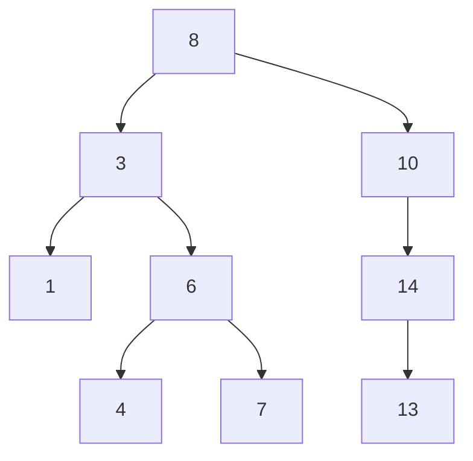

> 前置依赖：二叉树的基础定义、存储结构（二叉链表）、二叉树中序遍历规则
> 
> 核心目标：利用二叉树的非线性结构，实现动态数据集的高效查找、插入、删除操作，将有序数据的查找效率从线性表的 O (n) 优化至平均 O (logn)，是平衡二叉树、B + 树等高级数据结构的核心基础

---

### 📌 核心定义：什么是二叉排序树？

**二叉排序树（Binary Search Tree，BST）** 是一种满足**顺序性**的特殊二叉树，也叫二叉查找树、二叉搜索树，是二叉树最核心的工程应用场景之一。

其核心顺序性规则（图片核心内容）：

1. 若一个结点的左子树非空，则左子树上**所有结点的值均小于该结点的值**
2. 若一个结点的右子树非空，则右子树上**所有结点的值均大于该结点的值**
3. 该结点的左、右子树，也分别是一棵二叉排序树

> 🎯 核心性质（图片重点，考研必考）：**二叉排序树的中序遍历序列，是严格递增的有序序列**
> 
> 公式化表达：`(左子树 < 根 < 右子树)` 递归成立，因此中序遍历天然有序，是所有 BST 操作的核心基础。

---

### 🔑 标准测试用例（全操作验证用）

本笔记所有操作、代码均基于以下固定 BST，可直接输入代码运行验证，所有操作结果可通过中序序列校验合法性。

#### 测试用例输入

cpp

运行

```
9
8 3 10 1 6 14 4 7 13
```

#### 对应 BST 结构



#### 标准验证结果

| 操作            | 标准输出                   | 核心作用                   |
| :------------ | :--------------------- | :--------------------- |
| 中序遍历          | `1 3 4 6 7 8 10 13 14` | 校验 BST 顺序性是否合法，有序则结构正确 |
| 删除结点 3 后中序    | `1 4 6 7 8 10 13 14`   | 验证删除操作的正确性             |
| 修改 7 为 11 后中序 | `1 4 6 8 10 11 13 14`  | 验证修改操作的正确性             |

---

### 📌 核心特性：顺序性（BST 的灵魂）

BST 的所有操作、优势、缺陷，都源于其核心的顺序性规则，衍生出以下关键特性：

1. **查找的二分性**：每次与根结点比较后，可直接排除一半的结点（左子树 / 右子树），天然适配二分查找的逻辑
2. **动态有序性**：无需额外排序操作，中序遍历直接得到有序序列，支持动态增删后仍保持有序
3. **操作的递归性**：左右子树均为 BST，所有操作均可通过递归实现，代码简洁逻辑清晰
4. **唯一性约束**：BST 中不允许出现重复值，否则会破坏顺序性规则，工程中遇到重复值需抛出警告或特殊处理

---

### 🔍 四大核心操作（查找、插入、删除、修改）

BST 的四大核心操作均基于顺序性规则实现，是考研和工程的核心重点，对应图片全部内容。

---

#### 🔍 1. 查找操作（图片核心内容）

##### 💡 核心原理

基于 BST 的顺序性，每次比较后直接排除一半的结点，无需遍历整棵树，是 BST 最核心的操作。

##### 📋 标准化执行步骤（图片内容）

1️⃣ **判空**：空树直接判定目标不存在，返回 `nullptr`

2️⃣ **根结点比较**：若当前结点值等于目标值，查找成功，返回当前结点

3️⃣ **左子树查找**：若目标值小于当前结点值，仅需向左子树查找，直接排除整个右子树

4️⃣ **右子树查找**：若目标值大于当前结点值，仅需向右子树查找，直接排除整个左子树

##### 📊 实现逻辑对比

|实现方式|核心逻辑|工程优势|
|:--|:--|:--|
|非递归实现|用循环遍历 + 指针移动实现|无递归栈溢出风险，执行效率更高，工程首选|
|递归实现|基于 BST 的递归特性，递归查找左右子树|代码简洁，可读性强，适合教学与快速实现|

---

#### ➕ 2. 插入操作（图片核心内容）

##### 💡 核心原理

插入操作的核心是**找到符合顺序性的空插入位置**，保证插入后仍满足 BST 的顺序性规则，新结点永远作为叶子结点插入。

##### 📋 标准化执行步骤（图片内容）

1️⃣ **空树处理**：空树直接将新结点作为根结点插入

2️⃣ **查找插入位置**：执行查找操作，因插入值不存在，最终会停在 `NULL` 位置

3️⃣ **记录父结点**：查找过程中用 `pre` 指针永久记录当前结点的父结点，最终 `pre` 就是新结点的父结点

4️⃣ **挂载新结点**：比较插入值与父结点值的大小，挂载到父结点的左 / 右孩子位置

5️⃣ **重复值处理**：若插入值已存在，直接抛出警告⚠️，不执行插入，保证 BST 唯一性

---

#### 🗑️ 3. 删除操作（图片核心内容，考研最高频考点⚠️）

##### 💡 核心原理

删除操作的核心是**删除结点后，仍保持 BST 的顺序性规则**，根据待删结点的度（孩子数量），分为三种场景处理，核心难点是 2 度结点的删除。

##### 📋 标准化执行步骤（图片内容）

1️⃣ **前置校验**：空树、目标结点不存在，直接抛出异常，无法执行删除

2️⃣ **定位结点**：执行查找操作，定位待删结点 `p` 及其父结点 `pre`

3️⃣ **分场景删除**：

- **场景 1️⃣：待删结点度为 0（叶子结点）**
    
    找到父结点 `pre`，将 `pre` 指向 `p` 的指针置为 `NULL`，直接释放 `p` 的内存
- **场景 2️⃣：待删结点度为 1（仅有一个孩子）**
    
    找到父结点 `pre`，将 `pre` 指向 `p` 的指针，改为指向 `p` 的唯一孩子，用孩子结点顶替待删结点的位置，释放 `p` 的内存
- **场景 3️⃣：待删结点度为 2（左右孩子均存在）**
    
    🎯 核心思路：**将 2 度结点的删除，转化为 0/1 度结点的删除**
    
    1. 找到待删结点 `p` 的**中序前驱（左子树最右结点）** 或 **中序后继（右子树最左结点）**
    2. 用前驱 / 后继结点的值，覆盖待删结点 `p` 的值
    3. 将待删结点更新为该前驱 / 后继结点，其度一定为 0/1，直接按场景 1/2 删除即可
        
        4️⃣ **内存释放**：释放待删结点内存，指针置空，杜绝野指针🚫
    

> 🎯 考试核心结论：2 度结点的中序前驱 / 后继，一定是度为 0/1 的结点，不会出现递归嵌套的删除问题。

---

#### ✏️ 4. 修改操作

##### 💡 核心原理

**不能直接修改结点的值**，否则会破坏 BST 的顺序性规则；正确的修改逻辑是：**先删除旧值结点，再插入新值结点**，保证修改后仍满足 BST 的顺序性。

##### 📋 标准化执行步骤

1️⃣ **前置校验**：空树、旧值不存在，直接抛出异常

2️⃣ **删除旧值**：执行删除操作，删除值为 `x` 的结点

3️⃣ **插入新值**：执行插入操作，插入值为 `y` 的新结点

4️⃣ **合法性校验**：中序遍历仍为有序序列，修改完成✅

---

### ⚠️ 核心优缺点与优化方向（图片核心内容）

#### 1. 核心优势

- 📈 **查找效率高**：平均情况下，查找、插入、删除的时间复杂度均为 O (logn)，远优于线性表的 O (n)
- 📈 **动态有序性**：支持动态增删，无需额外排序操作，中序遍历直接得到有序序列
- 📈 **实现简单**：基于二叉链表存储，递归 / 非递归实现逻辑清晰，工程落地成本低
- 📈 **扩展性强**：是平衡二叉树、红黑树、B + 树等数据库索引核心结构的基础

#### 2. 核心缺陷（图片重点）

- ⚠️ **最坏情况效率退化**：若用于建树的初始数据有序，建立的 BST 会退化为**斜树**，此时树的高度为 n，所有操作的时间复杂度退化为 O (n)，完全失去优化效果
- ⚠️ **平衡性无法保证**：普通 BST 无法保证左右子树的高度差，极端场景下效率急剧下降
- ⚠️ **不支持重复值**：原生 BST 无法处理重复值，需额外扩展逻辑

#### 3. 优化方向（图片核心内容）

二叉排序树的核心优化目标，是**保证树的高度稳定在 O (logn)**，避免斜树退化，由此衍生出**二叉平衡树**（AVL 树、红黑树），通过旋转操作保证树的平衡性，将所有操作的时间复杂度稳定在 O (logn)，是工程中 BST 的主流落地形态。

---

### 🎯 考研（408）核心考点与考法

#### ⚠️ 选择题高频秒杀考点

1. **核心性质**：BST 的中序遍历序列一定是严格有序序列，可通过中序序列直接判断 BST 的合法性
2. **卡特兰数考点**：n 个不同的结点，可构成的不同 BST 的总数 = 第 n 个卡特兰数，与先序序列固定时二叉树的总数考点完全联动
3. **斜树考点**：有序序列建树会退化为斜树，高度为 n，时间复杂度 O (n)，是选择题高频错误坑
4. **查找长度考点**：BST 的平均查找长度 ASL 与树的高度直接相关，平衡 BST 的 ASL 为 O (logn)，斜树为 O (n)
5. **唯一性考点**：给定 BST 的中序序列 + 前序 / 后序 / 层序序列，可唯一确定一棵 BST；仅给定前序 + 后序，无法唯一确定

#### ✅ 大题核心考法

1. **BST 的构建**：给定序列，手动画出 BST 结构，写出中序序列
2. **删除操作**：给定 BST，删除指定 2 度结点，画出删除后的结构
3. **查找操作**：计算给定 BST 的平均查找长度 ASL，分析查找效率
4. **代码实现**：写出 BST 的查找、插入、删除的递归 / 非递归代码，是数据结构大题高频考点

#### 🚫 考研避坑技巧

1. 插入操作：新结点永远是叶子结点，不会插入到树的中间位置，选择题可直接排除错误选项
2. 删除操作：2 度结点删除后，BST 的中序序列除了被删除的值，其余元素顺序完全不变
3. 合法性判断：只要中序序列不是严格递增的，一定不是合法的 BST，可快速秒杀选择题
4. 效率分析：只要出现 “有序序列建树”，直接判定时间复杂度为 O (n)，无需额外计算

---

### 📊 时间与空间复杂度分析

|操作|平均时间复杂度|最坏时间复杂度（斜树）|空间复杂度|补充说明|
|:--|:--|:--|:--|:--|
|🔍 查找操作|O(logn)|O(n)|O(h)|h 为树的高度，平均 h=log₂n，最坏 h=n|
|➕ 插入操作|O(logn)|O(n)|O(h)|新结点为叶子结点，仅需修改父结点指针|
|🗑️ 删除操作|O(logn)|O(n)|O(h)|2 度结点仅需一次值覆盖 + 一次 0/1 度删除|
|📜 中序遍历|O(n)|O(n)|O(h)|每个结点仅访问一次，栈开销与树高相关|
|🏗️ 建树操作|O(nlogn)|O(n²)|O(n)|n 个结点依次插入，有序序列建树最坏 O (n²)|

> 📌 核心说明：空间复杂度由算法思想决定，与递归 / 非递归实现方式无关，均为 O (h)；递归实现的栈由编译器自动维护，非递归实现的栈由手动维护，本质开销一致。

### 💻 工程化代码实现（C++ 面向对象，非递归 + 递归双版本）

> 设计哲学：**接口与实现分离**，对外接口负责边界合法性校验、异常处理、用户友好提示；
> 内部辅助函数专注核心算法实现，职责清晰、可复用性强；
> 严格遵循 C++ 工程化规范，保证 const 正确性、内存安全、异常安全。

```cpp
#include <iostream>
#include <stdexcept>
#include <format>
#include <stack>

/*
9
8 3 10 1 6 14 4 7 13
*/

// 增删改查：非递归实现
namespace binary_search_tree_iterator {
    class BST {
        // 私有成员变量：仅允许外部通过内部成员方法间接调用，隐藏直接访问
        // 优先声明嵌套类：防止编译无法识别函数中自定义的嵌套类变量类型
        // 优先声明成员变量：与私有/非私有方法隔离，模块化增强可读性
    private:
        struct Node {
            int data;
            Node* left;
            Node* right;

            // explicit 禁止「单参数构造函数的隐式类型转换」，防止编译器偷偷做意想不到的类型转换
            explicit Node(int a = 0) : data(a), left(nullptr), right(nullptr) {}
        };
        // 类型别名：内部使用，简化代码，增强可读性
        using BSTree = Node*;
        // 成员变量采用后缀下划线，区分局部变量
        BSTree root_;

        // 公有算法，外部调用，(除构造与析构)按运行逻辑顺序声明与实现
    public:
        // 自定义构造函数：显式初始化空树，简化操作
        BST() noexcept : root_(nullptr) {};

        // 自定义析构函数：清除对象树空间，防止默认析构仅销毁当前对象成员的单个 root 指针
        ~BST() noexcept {
            DestroyTree(root_);
        }

        // 禁止拷贝构造和拷贝赋值（防止浅拷贝导致双重释放）
        BST(const BST&) = delete;
        BST& operator=(const BST&) = delete;

        // 所有 IO 操作，必须检查是否执行成功
        void BuildTree() {
            int n;
            // 检查读取是否成功 + 数值合法性，抛出异常而非隐式 return 返回
            if (!(std::cin >> n) || n <= 0) {
                throw std::invalid_argument("Invalid node count (must be a positive integer).");
            }

            int node_data;
            for (int i = 1; i <= n; i++) {
                if (!(std::cin >> node_data)) {
                    throw std::runtime_error("Failed to read node data.");
                }
                Insert(node_data);
            }
        }

        // 插入结点外部接口方法，特殊情况排除 + 调用底层辅助函数实现功能
        void Insert(int x) {
            // 边界判断：空树直接创建根节点，无需遍历查找父节点
            if (!root_) {
                root_ = new Node(x);
                return;
            }
            // 非空树 -> 调用底层实现
            InsertHelper(x);
        }

        // 删除结点外部接口方法，特殊情况排除 + 调用底层辅助函数实现功能
        void Delete(int x) {
            // 边界判断：空树直接抛出异常，无节点可删除
            if (!root_) {
                throw std::runtime_error("Delete failed : Tree is empty.");
            }
            // 非空树 -> 调用底层实现
            DeleteHelper(x);
        }

        // 修改结点值外部接口方法，特殊情况排除 + 合法性校验 + 调用底层辅助函数实现功能
        void Change(int x, int y) {
            // 边界判断：空树直接抛出异常，无节点可修改
            if (!root_) {
                throw std::runtime_error("Change failed : Tree is empty.");
            }
            // 校验待修改节点是否存在，不存在则抛出异常
            if (!SearchHelper(x)) {
                throw std::runtime_error(std::format("Change failed : There is no data {} in the tree.", x));
            }
            // 校验通过 -> 调用底层实现
            ChangeHelper(x, y);
        }

        // 查找结点外部接口方法，特殊情况提示 + 调用底层辅助函数实现功能
        Node* Search(int x) const {
            Node* temp = SearchHelper(x);
            // 边界判断：未找到节点则控制台提示
            if (!temp) {
                std::cerr << std::format("There is no data {} in the tree.", x) << std::endl;
            }
            return temp;
        }

        // 中序遍历外部接口方法，特殊情况排除 + 执行提示 + 调用底层辅助函数实现功能
        void InOrderTraverse() const {
            // 边界判断：空树直接提示返回，不进入底层执行(辅助)函数，剔除无效调用情况
            if (!root_) {
                throw std::runtime_error("In-Order Traversal failed : Tree is empty.");
            }
            std::cout << "In-Order Traversal: ";
            // 非空树 -> 调用底层实现
            InOrderHelper();
            std::cout << std::endl;
        }

        // 私有方法，类内调用，按用户可能关心程度声明与实现
    private:
        // 析构辅助函数，非递归中序实现内存销毁
        void DestroyTree(BSTree root) { // 中序删除
            std::stack<Node*> s;
            Node* cur = root_;
            while (cur || !s.empty()) {
                if (cur) {
                    s.push(cur);
                    cur = cur->left;
                }
                else {
                    // 核心细节：删除节点前保存右孩子指针，防止指针丢失导致内存泄漏
                    cur = s.top()->right;
                    Node* temp = s.top();
                    s.pop();
                    delete temp;
                }
            }
        }

        // 插入结点底层实现（仅处理常规情况具体逻辑）
        // 核心：遍历查找插入位置，pre记录父节点，最终挂载新节点
        void InsertHelper(int x) {
            Node* p = root_;
            Node* pre = nullptr;
            // 遍历至空位置，pre永久保留父节点指针
            while (p && p->data != x) {
                pre = p;
                // BST规则：左小右大，遍历查找
                if (x < p->data) p = p->left;
                else p = p->right;
            }
            // 考试重点：二叉搜索树不允许重复节点，直接警告不插入
            if (p && p->data == x)
                std::cerr << std::format("Warning : Duplicate data {}, please enter another data ", x) << std::endl;
            else {
                Node* new_node = new Node(x);
                // 核心细节：根据值大小，挂载到父节点的左/右孩子
                if (pre->data < x) {
                    pre->right = new_node;
                }
                else {
                    pre->left = new_node;
                }
            }
        }

        // 删除结点底层实现（仅处理常规情况具体逻辑）
        // 考试核心考点：0/1度节点直接删除，2度节点转换为0/1度节点删除
        void DeleteHelper(int x) {
            Node* p = root_;
            Node* pre = nullptr;
            // p指向要删的结点，pre指向该结点的父结点
            while (p && p->data != x) {
                pre = p;
                if (x < p->data) p = p->left;
                else p = p->right;
            }
            // 边界判断：遍历完毕未找到目标节点，直接抛出异常
            if (!p) {
                throw std::runtime_error(std::format("Delete failed : There is no data {} in the tree.", x));
            }
            // 2度节点：q指向待删结点的中序前驱，fq指向该结点的父结点
            // 将删除2度结点问题转化为删除0/1度结点问题
            if (p->left && p->right) {
                Node* q = p->left;
                Node* fq = p;
                // 核心细节：左子树最右节点 = 当前节点的中序前驱
                while (q->right) {
                    fq = q;
                    q = q->right;
                }
                // 用前驱节点的值覆盖待删节点
                p->data = q->data;
                // 更新待删节点为中序前驱，pre同步更新为前驱的父节点
                p = q;
                pre = fq;
            }
            // 0/1度节点：tg指向待删节点的唯一孩子(0度则为空)
            Node* tg = nullptr;
            if (p->left) tg = p->left;
            else tg = p->right;
            // 边界判断：待删节点为根节点，直接更新根指针
            if (!pre) {
                root_ = tg;
            }
            // 核心细节：重新建立父节点与子节点的联结，完成删除
            else {
                if (pre->left == p) pre->left = tg;
                else pre->right = tg;
            }
            // 内存安全：释放节点后指针置空，杜绝野指针
            delete p;
            p = nullptr;
        }

        // 修改值底层实现：删除旧值 + 插入新值，保证BST性质不变
        void ChangeHelper(int x, int y) {
            DeleteHelper(x);
            InsertHelper(y);
        }

        // 查找结点底层实现（仅处理常规情况具体逻辑）
        // 核心：BST查找规则，左小右大，空树直接返回nullptr
        Node* SearchHelper(int x) const {
            Node* p = root_;
            // 空树自动不进入循环
            while (p && p->data != x) {
                if (x < p->data) p = p->left;
                else p = p->right;
            }
            return p; // 没找到自动返回 nullptr
        }

        // 中序遍历底层实现（非递归，栈实现）
        void InOrderHelper() const noexcept {
            std::stack<Node*> s;
            Node* cur = root_;
            while (cur || !s.empty()) {
                if (cur) {
                    s.push(cur);
                    cur = cur->left;
                }
                else {
                    std::cout << s.top()->data << ' ';
                    cur = s.top()->right;
                    s.pop();
                }
            }
        }
    };

    // 不属于类对象的特定功能，类外命名空间内声明实现
    void runTest() {
        std::cout << "Iterative implementation:" << std::endl;
        try {
            BST tree;
            tree.BuildTree();
            tree.InOrderTraverse();
            tree.Delete(3);
            tree.InOrderTraverse();
            tree.Change(7, 11);
            tree.InOrderTraverse();
        }
        catch (const std::exception& e) {
            // try-catch 抛出的错误信息，cerr 报错打印
            std::cerr << "Error: " << e.what() << std::endl;
        }
        std::cout << std::endl;
    }
}

// 增删改查：递归实现
namespace binary_search_tree_recursion {
    class BST {
        // 私有成员变量：仅允许外部通过内部成员方法间接调用，隐藏直接访问
    private:
        struct Node {
            int data;
            Node* left;
            Node* right;

            Node(int a = 0) : data(a), left(nullptr), right(nullptr) {};
        };
        // 类型别名：内部使用，简化代码
        using BSTree = Node*;
        // 成员变量后缀下划线，区分局部变量
        BSTree root_;

        // 公有算法，外部调用
    public:
        // 构造函数：初始化空树
        BST() noexcept : root_(nullptr) {}

        // 析构函数：递归销毁整棵树
        ~BST() noexcept {
            DestroyTree(root_);
        }

        // 禁止拷贝构造和拷贝赋值，防止浅拷贝双重释放
        BST(const BST&) = delete;
        BST& operator=(const BST&) = delete;

        // 构建二叉搜索树，IO校验+循环插入
        void BuildTree() {
            int n;
            // IO合法性校验
            if (!(std::cin >> n) || n <= 0) {
                throw std::invalid_argument("Invalid node count (must be a positive integer).");
            }

            int node_data;
            for (int i = 1; i <= n; i++) {
                if (!(std::cin >> node_data)) {
                    throw std::runtime_error("Failed to read node data.");
                }
                Insert(node_data);
            }
        }

        // 递归插入外部接口：通过返回值更新根节点
        void Insert(int x) {
            root_ = InsertHelper(root_, x);
        }

        // 递归删除外部接口：空树判断+调用底层实现
        void Delete(int x) {
            // 边界判断：空树抛出异常
            if (!root_) {
                throw std::runtime_error("Delete failed : Tree is empty.");
            }
            root_ = DeleteHelper(root_, x);
        }

        // 递归修改外部接口：空树判断+存在性校验+调用底层实现
        void Change(int x, int y) {
            // 边界判断：空树抛出异常
            if (!root_) {
                throw std::runtime_error("Change failed : Tree is empty.");
            }
            if (!SearchHelper(root_, x)) {
                throw std::runtime_error(std::format("Change failed : There is no data {} in the tree.", x));
            }
            ChangeHelper(root_, x, y);
        }

        // 递归查找外部接口：未找到则提示
        Node* Search(int x) const {
            Node* temp = SearchHelper(root_, x);
            if (!temp) {
                std::cerr << std::format("There is no data {} in the tree.", x) << std::endl;
            }
            return temp;
        }

        // 递归中序遍历外部接口：空树判断+执行提示
        void InOrderTraverse() const {
            // 边界判断：空树直接提示返回
            if (!root_) {
                throw std::runtime_error("In-Order Traversal failed : Tree is empty.");
            }
            std::cout << "In-Order Traversal: ";
            InOrderHelper(root_);
            std::cout << std::endl;
        }

        // 私有辅助方法，类内调用
    private:
        // 后序递归销毁：先删子树，再删根节点，避免内存泄漏
        void DestroyTree(BSTree root) {
            if (!root) return;
            DestroyTree(root->left);
            DestroyTree(root->right);
            delete root;
        }

        // 递归插入底层实现
        // 核心：返回新子树根节点，实现与父节点的联结
        BSTree InsertHelper(BSTree root, int x) {
            // 递归终止：空位置创建新节点，返回给上层挂载
            if (!root) {
                Node* node = new Node(x);
                return node;
            }
            // BST规则：左小右大，递归挂载
            if (x < root->data) {
                root->left = InsertHelper(root->left, x);
            }
            else if (x > root->data) {
                root->right = InsertHelper(root->right, x);
            }
            else {
                // 考试重点：重复值不插入，返回原节点
                std::cerr << std::format("Warning : Duplicate data {}, please enter another data ", x) << std::endl;
            }
            return root;
        }

        // 递归删除底层实现（考试核心考点）
        // 核心：返回删除后的子树根节点，通过上一层赋值与父节点联结
        BSTree DeleteHelper(BSTree root, int x) {
            // 边界判断：递归至空节点，目标不存在，抛出异常
            if (!root) {
                throw std::runtime_error(std::format("Delete failed : There is no data {} in the tree.", x));
            }
            // 递归查找待删节点
            if (x < root->data) {
                root->left = DeleteHelper(root->left, x);
            }
            else if (x > root->data) {
                root->right = DeleteHelper(root->right, x);
            }
            else {
                // 2度节点：找中序后继（右子树最左节点）替换
                if (root->left && root->right) {
                    Node* q = root->right;
                    // 核心细节：右子树最左节点 = 中序后继
                    while (q->left) {
                        q = q->left;
                    }
                    root->data = q->data;
                    // 递归删除中序后继节点
                    root->right = DeleteHelper(root->right, q->data);
                }
                // 0/1度节点：直接删除，返回孩子节点
                else {
                    Node* p = root;
                    if (root->left) root = root->left;
                    else root = root->right;
                    delete(p);
                    p = nullptr;
                }
            }
            // 返回上一层，通过上一层赋值让新结点与父结点联结
            return root;
        }

        // 递归修改实现：删除旧值+插入新值
        void ChangeHelper(BSTree root, int x, int y) {
            DeleteHelper(root, x);
            InsertHelper(root, y);
        }

        // 递归查找底层实现：左小右大，终止条件为空/找到目标
        Node* SearchHelper(BSTree root, int x) const {
            if (!root || root->data == x) return root;
            if (x < root->data) return SearchHelper(root->left, x);
            else return SearchHelper(root->right, x);
        }

        // 递归中序遍历：左->根->右
        void InOrderHelper(BSTree root) const noexcept {
            if (root == nullptr) {
                return;
            }
            InOrderHelper(root->left);
            std::cout << root->data << " ";
            InOrderHelper(root->right);
        }
    };

    // 测试函数
    void runTest() {
        std::cout << "Recursive implementation:" << std::endl;
        try {
            BST tree;
            tree.BuildTree();
            tree.InOrderTraverse();
            tree.Delete(3);
            tree.InOrderTraverse();
            tree.Change(7, 11);
            tree.InOrderTraverse();
        }
        catch (const std::exception& e) {
            std::cerr << "Error: " << e.what() << std::endl;
        }
    }
}

// 主函数：测试非递归+递归两个版本
int main()
{
    binary_search_tree_iterator::runTest();
    binary_search_tree_recursion::runTest();

    return 0;
}
```