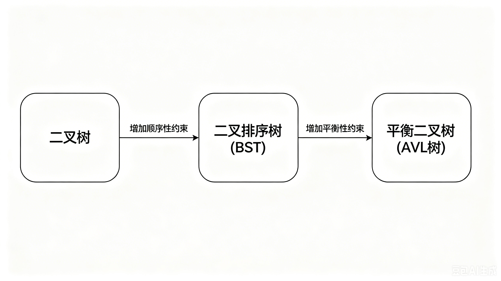
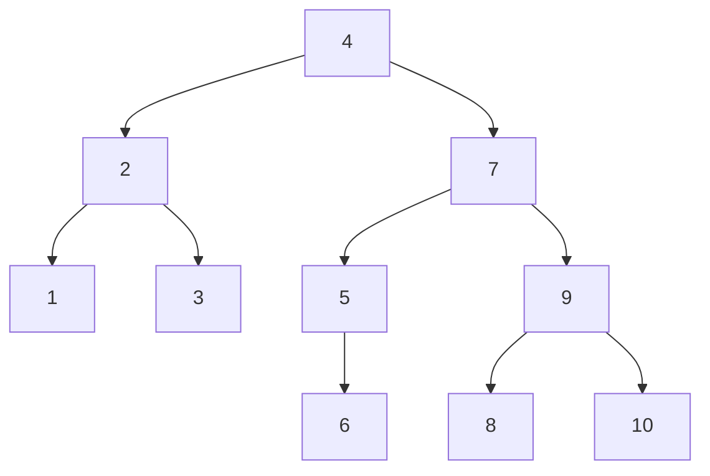

> 前置依赖：二叉树基础定义、二叉链表存储、二叉排序树（BST）全部操作
> 
> 核心目标：解决普通 BST 在有序数据下退化为斜树的致命缺陷，通过自动平衡调整保证树的高度稳定在 O (logn)，将所有操作的时间复杂度从最坏 O (n) 优化至稳定 O (logn)，是数据库索引、红黑树等高级数据结构的核心基础

---

### 📌 核心定义：什么是平衡二叉树？

**平衡二叉树（Adelson-Velsky-Landis Tree，AVL 树）** 是一种**自平衡的二叉排序树**，完全继承 BST 的顺序性，新增了**平衡性约束**，是普通 BST 的优化版本。

#### 核心演进路线（核心内容）



1. **顺序性约束（完全继承 BST）**
    
    - 左子树所有结点值 < 根结点值 < 右子树所有结点值
    - 中序遍历序列严格递增，是所有操作的基础
    
2. **平衡性约束（AVL 独有，图片核心内容）**
    
    - **平衡因子（BF）**：结点的左子树高度 - 右子树高度
    - 所有结点的平衡因子绝对值 ≤ 1，即左右子树高度差最多为 1
    - 空结点高度定义为 0，叶子结点高度为 1
    - 
#### 核心计算公式（核心内容）

```cpp
结点高度 = max(左孩子高度, 右孩子高度) + 1
平衡因子(BF) = 左子树高度 - 右子树高度
```

> 🎯 核心结论：AVL 树 = BST 的顺序性 + 严格的平衡性约束，彻底解决了普通 BST 的斜树退化问题。

---

### 📊 AVL 树的优缺点（核心内容）

|优点|缺点|
|:--|:--|
|✅ 查找效率稳定 O (logn)，无斜树退化风险|❌ 插入 / 删除操作需要额外的平衡调整，开销较大|
|✅ 所有结点的平衡因子绝对值≤1，树高可控|❌ **适用于静态查找，不适用于频繁动态增删的场景**|
|✅ 完全继承 BST 的中序有序性，数据天然有序|❌ 调整操作复杂，代码实现难度高于普通 BST|
|✅ 无重复值问题，适合作为有序数据集的索引结构|❌ 每次删除可能需要多次递归调整，效率受影响|

---

### 🔑 标准测试用例（全操作验证用）

本笔记所有操作、代码均基于以下测试用例，专门验证 AVL 树对**有序序列**的平衡能力（普通 BST 会退化为斜树，AVL 会自动平衡）。

#### 测试用例输入

```cpp
10
1 2 3 4 5 6 7 8 9 10
```

#### 对应 AVL 树结构（自动平衡后）




#### 标准验证结果（中序遍历 + 平衡因子）

```cpp
In-Order Traversal: 
1 0
2 0
3 0
4 0
5 -1
6 0
7 0
8 0
9 0
10 0
```

> ✅ 验证：所有结点平衡因子绝对值≤1，中序序列严格递增，AVL 树合法。

---

### 📌 核心特性

1. **顺序性**：完全继承 BST 的所有特性，查找逻辑与 BST 完全一致
2. **自平衡性**：插入、删除操作后自动进行平衡调整，保证树的高度稳定在 O (logn)
3. **最小失衡子树**：所有平衡调整都从**离操作结点最近的失衡结点**（最小失衡子树的根）开始
4. **插入特性**：插入操作导致的失衡，只需对最小失衡子树进行**一次旋转调整**，即可恢复整棵树的平衡
5. **删除特性**：删除操作导致的失衡，调整后可能使子树整体高度减 1，进而导致祖先结点失衡，需**自下而上递归调整**

---

### 🔍 四大核心操作（查找、插入、删除、修改）

AVL 树的所有操作都遵循**先执行 BST 操作，再进行平衡调整**的统一流程（图片核心内容）。

---

#### 🔍 1. 查找操作

##### 💡 核心原理

与普通 BST 完全一致，基于顺序性进行二分查找，每次比较排除一半结点，无需任何平衡调整。

##### 📋 标准化执行步骤

1. 判空：空树直接返回 nullptr
2. 根结点比较：相等则返回当前结点
3. 左子树查找：目标值更小则递归左子树
4. 右子树查找：目标值更大则递归右子树

> 🎯 考试结论：AVL 树的查找效率稳定在 O (logn)，远优于普通 BST 的最坏 O (n)。

---

#### ➕ 2. 插入操作（考研高频考点）

##### 💡 核心原理

先按照 BST 规则插入新结点（新结点永远是叶子结点），然后**自下而上检查所有直系祖先的平衡性**，找到最小失衡子树，根据失衡类型进行对应旋转调整。

##### 📋 标准化执行步骤

1. **BST 插入**：递归找到空位置，插入新结点
2. **更新高度**：递归返回时更新当前结点的高度
3. **检查平衡**：计算当前结点的平衡因子，判断是否失衡
4. **失衡调整**：根据失衡类型（LL/LR/RR/RL）执行对应旋转
5. **返回新根**：返回调整后的子树根结点，完成上层联结

##### 🎯 插入失衡核心结论

1. 新结点的**父结点一定不会失衡**，失衡结点至少离插入结点 3 层
2. 失衡结点一定是新结点的**直系祖先**
3. 只需调整**最小失衡子树**，调整后整棵树自动恢复平衡，无需向上继续调整
4. 插入操作最多只需**一次旋转**即可完成平衡

##### 四种失衡类型与调整方式

| 失衡类型     | 定义              | 调整方式                         |
| :------- | :-------------- | :--------------------------- |
| **LL 型** | 在失衡结点的左孩子的左子树插入 | 对失衡结点执行**右旋**                |
| **LR 型** | 在失衡结点的左孩子的右子树插入 | 先对左孩子执行**左旋**，再对失衡结点执行**右旋** |
| **RR 型** | 在失衡结点的右孩子的右子树插入 | 对失衡结点执行**左旋**                |
| **RL 型** | 在失衡结点的右孩子的左子树插入 | 先对右孩子执行**右旋**，再对失衡结点执行**左旋** |

---

#### 🗑️ 3. 删除操作（考研最高频考点）

##### 💡 核心原理

先按照 BST 规则删除结点，然后**自下而上检查所有祖先的平衡性**，若失衡则进行对应旋转调整；由于调整可能导致子树高度减 1，需继续向上递归检查祖先的平衡性。

##### 📋 标准化执行步骤

1. **BST 删除**：递归找到目标结点，按 BST 删除规则（0/1/2 度结点）删除
2. **更新高度**：递归返回时更新当前结点的高度
3. **检查平衡**：计算当前结点的平衡因子，判断是否失衡
4. **失衡调整**：根据失衡类型执行对应旋转
5. **递归返回**：返回调整后的子树根结点，继续向上检查祖先平衡性

##### 🎯 删除失衡核心结论

1. 删除后、调整前，**最多只有一个结点失衡**
2. 删除导致的失衡类型与插入一一对应：
    
    - 左子树删除结点 → 相当于右子树插入结点 → 对应 RR/RL 型失衡
    - 右子树删除结点 → 相当于左子树插入结点 → 对应 LL/LR 型失衡
    - 若左右子树高度相等 → 按 RR/LL 型处理（单旋转）
    
3. 调整后会导致被调整子树的**整体高度减 1**，可能引发祖先结点失衡
4. 因此删除操作可能需要**多次自下而上的递归调整**，直到根结点

---

#### ✏️ 4. 修改操作

##### 💡 核心原理

与普通 BST 完全一致，**不能直接修改结点值**（会破坏顺序性），正确逻辑是：**先删除旧值结点，再插入新值结点**，插入时自动完成平衡调整。

##### 📋 标准化执行步骤

1. 前置校验：空树、旧值不存在则抛出异常
2. 删除旧值：执行删除操作，自动完成平衡调整
3. 插入新值：执行插入操作，自动完成平衡调整
4. 合法性校验：中序序列有序且所有结点平衡因子合法

---

### 🔄 四大旋转操作详解

旋转操作是 AVL 树平衡调整的核心，本质是通过改变结点的父子关系，在不破坏顺序性的前提下，降低子树高度，恢复平衡性。

---

#### ↩️ 右旋操作（Right Rotate，对应 LL 型失衡）

##### 💡 适用场景

失衡结点的左子树比右子树高 2，且左孩子的左子树更高（LL 型）。

##### 📋 执行步骤

1. 定义`q`为失衡结点`p`的左孩子
2. 将`q`的右子树挂载为`p`的左子树
3. 将`p`挂载为`q`的右子树
4. 先更新`p`的高度，再更新`q`的高度（先子后父）
5. 返回`q`作为新的子树根结点

##### 💻 代码实现

```cpp
AVLTree RightRotate(Node* p) {
    Node* q = p->left;          // q为p的左孩子

    p->left = q->right;          // q的右子树挂载为p的左子树
    q->right = p;               // p挂载为q的右子树

    // 更新结点高度（先子后父）
    p->h = std::max(GetH(p->left), GetH(p->right)) + 1;
    q->h = std::max(GetH(q->left), GetH(q->right)) + 1;
    // 返回新根结点
    return q;
}
```

---

#### ↪️ 左旋操作（Left Rotate，对应 RR 型失衡）

##### 💡 适用场景

失衡结点的右子树比左子树高 2，且右孩子的右子树更高（RR 型）。

##### 📋 执行步骤

1. 定义`q`为失衡结点`p`的右孩子
2. 将`q`的左子树挂载为`p`的右子树
3. 将`p`挂载为`q`的左子树
4. 先更新`p`的高度，再更新`q`的高度
5. 返回`q`作为新的子树根结点

##### 💻 代码实现

```cpp
AVLTree LeftRotate(AVLTree p) {
    AVLTree q = p->right;       // q为p的右孩子

    p->right = q->left;         // q的左子树挂载为p的右子树
    q->left = p;                // p挂载为q的左子树

    // 更新结点高度
    p->h = std::max(GetH(p->left), GetH(p->right)) + 1;
    q->h = std::max(GetH(q->left), GetH(q->right)) + 1;
    // 返回新根结点
    return q;
}
```

---

#### 🔄 LR 型旋转（先左旋后右旋）

##### 💡 适用场景

失衡结点的左子树比右子树高 2，且左孩子的右子树更高（LR 型）。

##### 📋 执行步骤

1. 对失衡结点的左孩子执行**左旋**（转化为 LL 型）
2. 对失衡结点执行**右旋**（恢复平衡）

##### 💻 代码实现

```cpp
AVLTree LRrotation(AVLTree p) {
    p->left = LeftRotate(p->left);  // 先对左孩子左旋
    p = RightRotate(p);             // 再对p右旋
    return p;
}
```

---

#### 🔄 RL 型旋转（先右旋后左旋）

##### 💡 适用场景

失衡结点的右子树比左子树高 2，且右孩子的左子树更高（RL 型）。

##### 📋 执行步骤

1. 对失衡结点的右孩子执行**右旋**（转化为 RR 型）
2. 对失衡结点执行**左旋**（恢复平衡）

##### 💻 代码实现

```cpp
AVLTree RLrotation(AVLTree p) {
    p->right = RightRotate(p->right); // 先对右孩子右旋
    p = LeftRotate(p);                // 再对p左旋
    return p;
}
```

---

### 📊 插入与删除平衡调整对比

|对比项|插入操作|删除操作|
|:--|:--|:--|
|失衡结点数量|可能多个直系祖先|调整前最多 1 个|
|旋转次数|最多 1 次|可能多次（自下而上递归）|
|调整后影响|子树高度不变，祖先自动平衡|子树高度减 1，可能引发祖先失衡|
|失衡类型|LL/LR/RR/RL|与插入一一对应（左删→右插，右删→左插）|

---

### 🎯 考研（408）核心考点与考法

#### ⚠️ 选择题高频秒杀考点

1. **平衡因子计算**：给定 AVL 树结构，快速计算任意结点的平衡因子
2. **旋转类型判断**：给定插入 / 删除位置，快速判断需要的旋转类型
3. **旋转次数判断**：插入最多 1 次旋转，删除可能多次旋转
4. **高度计算**：n 个结点的 AVL 树最小高度为⌈log₂(n+1)⌉，最大高度约为 1.44log₂(n+2)
5. **时间复杂度**：所有操作的时间复杂度均为稳定 O (logn)
6. **合法性判断**：只要有一个结点平衡因子绝对值 > 1，就不是合法 AVL 树

#### ✅ 大题核心考法

1. **手动画图**：给定序列，画出 AVL 树的插入 / 删除过程，标注每一步的平衡因子和旋转操作
2. **代码实现**：写出左旋 / 右旋、插入 / 删除的核心代码
3. **对比分析**：对比 AVL 树与普通 BST 的优缺点、适用场景
4. **复杂度分析**：分析 AVL 树的时间、空间复杂度，说明为什么能解决 BST 的退化问题

#### 🚫 考研避坑技巧

1. 旋转操作后必须先更新子结点的高度，再更新父结点的高度
2. 删除操作后即使当前结点平衡，也要更新高度并向上返回，因为祖先可能失衡
3. LR/RL 型旋转是两次单旋转的组合，顺序不能颠倒
4. 插入操作调整后，整棵树的高度不变，无需继续向上调整

---

### 📊 时间与空间复杂度分析

|操作|时间复杂度|空间复杂度|补充说明|
|:--|:--|:--|:--|
|🔍 查找操作|O(logn)|O(h)|h 为树的高度，稳定 h≈log₂n|
|➕ 插入操作|O(logn)|O(h)|最多一次旋转，时间复杂度由查找决定|
|🗑️ 删除操作|O(logn)|O(h)|最多 O (logn) 次旋转，总时间仍为 O (logn)|
|📜 中序遍历|O(n)|O(h)|每个结点仅访问一次|
|🏗️ 建树操作|O(nlogn)|O(n)|n 个结点依次插入，每个插入 O (logn)|

> 🎯 核心优势：与普通 BST 相比，AVL 树的最坏时间复杂度从 O (n) 优化至稳定 O (logn)，彻底解决了斜树退化问题。

---

### 💻 工程化代码实现（C++ 面向对象）

> 设计哲学：接口与实现分离，对外接口负责边界校验，内部辅助函数专注核心逻辑；严格遵循 C++ 工程规范，保证内存安全、异常安全。

```cpp
#include <iostream>
#include <cmath>
#include <stdexcept>
#include <format>

/*
10
1 2 3 4 5 6 7 8 9 10
*/

// 建树、增删改查、中序遍历、左旋、右旋
namespace balanced_binary_tree {
    // AVL平衡二叉树类实现
    class AVL {
    private:
        // AVL树结点结构体定义
        struct Node {
            int data;               // 结点存储的数据
            Node* left;             // 左孩子指针
            Node* right;            // 右孩子指针
            int h;                  // 该结点的高度

            // 结点构造函数，默认高度为1
            Node(int a = 0) : data(a), left(nullptr), right(nullptr), h(1) {}
        };
        using AVLTree = Node*;       // 别名：AVLTree代表结点指针
        AVLTree root_;               // AVL树的根节点

    public:
        // 构造函数：初始化空树
        AVL() noexcept : root_(nullptr) {}
        // 析构函数：销毁整棵树，释放内存
        ~AVL() noexcept {
            DestroyTree(root_);
        }

        // 禁用拷贝构造和赋值重载（防止浅拷贝）
        AVL(const AVL&) = delete;
        AVL& operator=(const AVL&) = delete;

        // 只有当函数存在【特殊边界处理 + 核心底层逻辑】需要分离时，才拆外层接口 + Helper 辅助函数；
        //    如果只有一套线性逻辑，直接写完就是最优解，绝不强行拆分。
        // 不要为了格式统一而强行拆分，只在有多套逻辑时才分离接口与辅助函数：
        // 顶层接口函数用于分离逻辑（特殊情况），辅助函数用于处理底层核心逻辑
        // BuildTree只有一套逻辑即循环调用Insert插入数据，因此完全没必要分离

        // 建树接口：读取输入数据，循环插入结点构建AVL树
        void BuildTree() {
            int n;
            // 检查读取是否成功 + 数值合法性，抛出异常而非隐式 return 返回
            if (!(std::cin >> n) || n <= 0) {
                throw std::invalid_argument("Invalid node count (must be a positive integer).");
            }

            int node_data;
            // 循环读取n个结点值，依次插入AVL树
            for (int i = 1; i <= n; i++) {
                if (!(std::cin >> node_data)) {
                    throw std::runtime_error("Failed to read node data.");
                }
                Insert(node_data);
            }
        }

        // 插入接口：对外提供插入数据的入口
        void Insert(int x) noexcept {
            // 调用辅助函数完成插入+平衡调整，更新根节点
            root_ = InsertHelper(root_, x);
        }

        // 删除接口：对外提供删除数据的入口
        void Delete(int x) {
            // 边界判断：空树抛出异常
            if (!root_) {
                throw std::runtime_error("Delete failed : Tree is empty.");
            }
            // 调用辅助函数完成删除+平衡调整，更新根节点
            root_ = DeleteHelper(root_, x);
        }

        // 修改接口：对外提供修改数据的入口
        void Change(int x, int y) {
            // 边界判断：空树抛出异常
            if (!root_) {
                throw std::runtime_error("Change failed : Tree is empty.");
            }
            // 调用辅助函数执行修改操作
            ChangeHelper(root_, x, y);
        }

        // 查找接口：对外提供查找数据的入口
        Node* Search(int x) const noexcept {
            // 调用辅助函数查找目标结点
            Node* temp = SearchHelper(root_, x);
            if (!temp) {
                std::cerr << std::format("There is no data {} in the tree.", x) << std::endl;
            }
            return temp;
        }

        // 中序遍历接口：对外提供中序遍历入口
        void InOrderTraverse() const {
            // 边界判断：空树直接提示返回，不进入底层执行(辅助)函数，剔除无效调用情况
            if (!root_) {
                throw std::runtime_error("In-Order Traversal failed : Tree is empty.");
            }
            std::cout << "In-Order Traversal: ";
            // 非空树 -> 调用底层实现递归遍历
            InOrderHelper(root_);
            std::cout << std::endl;
        }

    private:
        // 销毁树：递归释放所有结点内存
        void DestroyTree(AVLTree root) noexcept {
            if (!root) return;
            // 后序遍历释放：先左子树，再右子树，最后根节点
            DestroyTree(root->left);
            DestroyTree(root->right);
            delete(root);
            root = nullptr;
        }

        // 插入时引起多个直系祖先失衡 ---> 自下往上调整（旋转最小失衡子树（离插入结点最近的失衡结点））
        // 自下往上：失衡由新插入的结点引起，只需要恢复平衡这支子树，整体平衡
        // 自上往下：旋转让失衡子树的根结点及其儿子结点恢复平衡，对孙子开始的子树平衡性无影响，继续保持失衡

        // 插入辅助函数：递归插入结点 + 自动平衡调整（LL/LR/RR/RL）
        AVLTree InsertHelper(AVLTree root, int x) noexcept {
            // 递归终止：找到空位置，创建新结点并返回
            if (!root) {
                Node* node = new Node(x); // 给引用赋值，外部直接生效
                return node;
            }
            // 待插入值 < 当前结点值：递归插入左子树
            if (x < root->data) {
                // 左插时仅验证是否左子树过高
                root->left = InsertHelper(root->left, x);
                // 检查失衡：左子树比右子树高超过1
                if (GetH(root->left) - GetH(root->right) > 1) {
                    // 利用平衡性算高度，或利用顺序性比较大小，来判断 LL/LR
                    // 不会等于x，等于x的情况已被该分支开始的递归处理
                    Node* left = root->left;
                    if (x < left->data) {
                        // LL型失衡：执行右旋
                        root = LLrotation(root);
                    }
                    else {
                        // LR型失衡：执行左右旋
                        root = LRrotation(root);
                    }
                }
            }
            // 待插入值 > 当前结点值：递归插入右子树
            else if (x > root->data) {
                // 右插时仅验证是否右子树过高
                root->right = InsertHelper(root->right, x);
                // 检查失衡：右子树比左子树高超过1
                if (GetH(root->right) - GetH(root->left) > 1) {
                    Node* right = root->right;
                    if (x < right->data) {
                        // RL型失衡：执行右左旋
                        root = RLrotation(root);
                    }
                    else {
                        // RR型失衡：执行左旋
                        root = RRrotation(root);
                    }
                }
            }
            // 重复值：不插入，打印警告
            else {
                std::cerr << std::format("Warning : Duplicate data {}, please enter another data ", x) << std::endl;
            }
            // 重点：未调整时也更新高度(返回之前更新高度，该位置让所有情况都更新高度，如果有旋转，内部已经更新，所以说主要是为未调整情况更新高度)
            root->h = std::max(GetH(root->left), GetH(root->right)) + 1;

            return root; // 插入后返回新树
        }

        // 删除辅助函数：递归删除结点 + 自动平衡调整
        AVLTree DeleteHelper(AVLTree root, int x) {
            // 递归终止：未找到目标值，抛出异常
            if (!root) {
                throw std::runtime_error(std::format("Delete failed : There is no data {} in the tree.", x));
            }
            // 目标值 < 当前结点值：递归删除左子树
            if (x < root->data) {
                root->left = DeleteHelper(root->left, x);
                // 删除后检查失衡：右子树过高
                if (GetH(root->right) - GetH(root->left) > 1) {
                    Node* right = root->right;
                    if (GetH(right->right) >= GetH(right->left)) {// RR
                        root = RRrotation(root);
                    }
                    else {// RL
                        root = RLrotation(root);
                    }
                }
            }
            // 目标值 > 当前结点值：递归删除右子树
            else if (x > root->data) {
                root->right = DeleteHelper(root->right, x);
                // 删除后检查失衡：左子树过高
                if (GetH(root->left) - GetH(root->right) > 1) {
                    Node* left = root->left;
                    if (GetH(left->left) >= GetH(left->right)) {// LL
                        root = LLrotation(root);
                    }
                    else {// LR
                        root = LRrotation(root);
                    }
                }
            }
            // 找到目标删除结点
            else {
                // 情况1：结点有左右两个孩子
                if (root->left && root->right) {
                    // 找左子树的最右结点（中序前驱）
                    Node* q = root->left;
                    while (q->right) {
                        q = q->right;
                    }
                    // 用前驱结点的值覆盖当前结点
                    root->data = q->data;
                    // 递归删除前驱结点
                    root->left = DeleteHelper(root->left, q->data);
                }
                // 情况2：结点有0个或1个孩子
                else {
                    Node* p = root;
                    // 有左孩子：左孩子顶替当前结点
                    if (root->left) {
                        root = root->left;
                    }
                    // 有右孩子/无孩子：右孩子顶替当前结点
                    else root = root->right;
                    // 释放原结点内存
                    delete p;
                    p = nullptr;
                }
            }

            // 删除操作可能使 root 为 nullptr，非空时更新高度
            if (root) {
                root->h = std::max(GetH(root->left), GetH(root->right)) + 1;
            }
            return root;
        }

        // 修改辅助函数：链式传递，AVL修改 = 删除旧值 + 插入新值
        void ChangeHelper(AVLTree root, int x, int y) { // 链式传递
            AVLTree new_root = DeleteHelper(root, x);    // 第一步：删除值为x的旧结点，返回平衡后的树
            root_ = InsertHelper(new_root, y);           // 第二步：插入值为y的新结点，更新根节点
        }

        // 查找辅助函数：递归查找目标值结点
        Node* SearchHelper(AVLTree root, int x) const noexcept {
            // 递归终止：空树/找到目标结点，返回当前指针
            if (!root || root->data == x) return root;
            // 目标值更小：递归查左子树
            if (x < root->data) return SearchHelper(root->left, x);
            // 目标值更大：递归查右子树
            else return SearchHelper(root->right, x);
        }

        // 中序遍历验证顺序性
        // 其他遍历配合中序遍历验证平衡性（更优解：给中序遍历添加同时输出平衡因子来验证平衡性）

        // 中序遍历辅助函数：递归中序遍历 + 打印结点值+平衡因子
        void InOrderHelper(AVLTree root) const noexcept {
            if (!root) return;
            // 左子树
            InOrderHelper(root->left);
            // 计算平衡因子 = 左子树高 - 右子树高
            int bf = GetH(root->left) - GetH(root->right);
            // 打印结点值和平衡因子
            std::cout << std::endl << root->data << ' ' << bf;
            // 右子树
            InOrderHelper(root->right);
        }

        // 获取结点高度：空结点高度为0，非空结点返回自身高度
        int GetH(Node* p) const noexcept {
            return p ? p->h : 0;
        }

        // 引用前提：这里的引用绑定的是【指针变量本身】，而非指针指向的内存。
        // 合法情况：指针变量的值为 nullptr（指向空），但变量本身存在 → 引用完全安全、可正常使用、无未定义行为。
        // 非法情况：强行让引用绑定“空”（不存在的变量）→ 未定义行为，但递归场景中绝不会出现。
        // 结论：只要正常递归调用，传入的一定是合法指针变量（即使值为 nullptr），引用传递绝对安全可靠。
        // 引用传递优点：使函数内部能直接修改外部指针变量本身（更换子树根节点），无需返回值来修改外部指针
        // 如果值传递 + 无返回值 会导致隐性错误，正常中序遍历，但AVL还是BST（平衡调整没有传导到外部），再添加一种遍历能看出这点

        // 右旋操作：LL失衡调整核心逻辑
        AVLTree RightRotate(Node* p) {
            Node* q = p->left;          // q为p的左孩子

            p->left = q->right;          // q的右子树挂载为p的左子树
            q->right = p;               // p挂载为q的右子树

            // 更新结点高度（先子节点，后根节点）
            p->h = std::max(GetH(p->left), GetH(p->right)) + 1;
            q->h = std::max(GetH(q->left), GetH(q->right)) + 1;
            // 返回新根结点
            return q;
        }

        // 左旋操作：RR失衡调整核心逻辑
        // 内部更新树的高度
        AVLTree LeftRotate(AVLTree p) {
            AVLTree q = p->right;       // q为p的右孩子

            p->right = q->left;         // q的左子树挂载为p的右子树
            q->left = p;                // p挂载为q的左子树

            // 更新结点高度
            p->h = std::max(GetH(p->left), GetH(p->right)) + 1;
            q->h = std::max(GetH(q->left), GetH(q->right)) + 1;
            // 返回新根结点
            return q;
        }

        // 在p指向结点的左孩子的左子树中插入结点，导致p指向结点变成失衡结点，是LL情况，
        // 要对以p指向结点为根的子树进行右旋
        AVLTree LLrotation(AVLTree p) {
            p = RightRotate(p);
            return p;
        }

        // 在p指向结点的右孩子的右子树中插入结点，导致p指向结点变成失衡结点，是RR情况，
        // 要对以p指向结点为根的子树进行左旋
        AVLTree RRrotation(AVLTree p) {
            p = LeftRotate(p);
            return p;
        }

        // 在p指向结点的左孩子的右子树中插入结点，导致p指向结点变成失衡结点，是LR情况，
        // 要先对以p指向结点左孩子为根的子树进行左旋，再以p指向结点为根的子树进行右旋
        AVLTree LRrotation(AVLTree p) {
            p->left = LeftRotate(p->left);
            p = RightRotate(p);
            return p;
        }

        // 在p指向结点的右孩子的左子树中插入结点，导致p指向结点变成失衡结点，是RL情况，
        // 要先对以p指向结点右孩子为根的子树进行右旋，再以p指向结点为根的子树进行左旋
        AVLTree RLrotation(AVLTree p) {
            p->right = RightRotate(p->right);
            p = LeftRotate(p);
            return p;
        }
    };

    // 测试函数：执行AVL树的建树、遍历、删除、修改操作
    void runTest() {
        std::cout << "AVLTree implementation:" << std::endl;
        try {
            AVL tree;               // 创建AVL树对象
            tree.BuildTree();      // 构建树
            tree.InOrderTraverse();// 中序遍历
            tree.Delete(3);        // 删除结点3
            tree.InOrderTraverse();// 遍历验证
            tree.Change(7, 11);    // 修改结点7为11
            tree.InOrderTraverse();// 遍历验证
        }
        // 捕获异常并打印错误信息
        catch (const std::exception& e) {
            std::cerr << "Error: " << e.what() << std::endl;
        }
    }
}

int main() // 11
{
    balanced_binary_tree::runTest();

    return 0;
}
```

### 📝 核心笔记重点

1. 🔴 **核心定义**：AVL 树 = BST 的顺序性 + 平衡性约束（平衡因子绝对值≤1）
2. 🔴 **操作流程**：所有操作先执行 BST 逻辑，再进行平衡调整
3. 🔴 **旋转操作**：掌握左旋、右旋的代码逻辑，以及四种失衡类型对应的旋转组合
4. 🔴 **插入特性**：插入最多一次旋转，调整后子树高度不变
5. 🔴 **删除特性**：删除可能多次递归调整，调整后子树高度减 1
6. 🔴 **时间复杂度**：所有操作稳定 O (logn)，彻底解决 BST 斜树退化问题
7. 🔴 **考研重点**：平衡因子计算、旋转类型判断、手动画插入删除过程