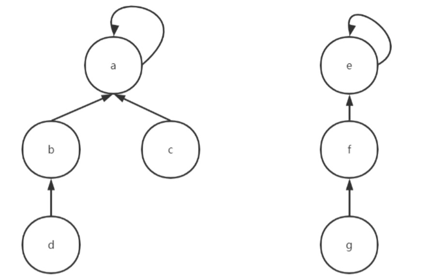
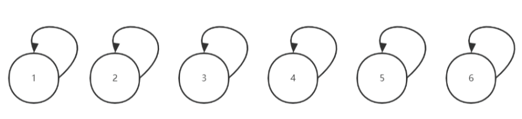
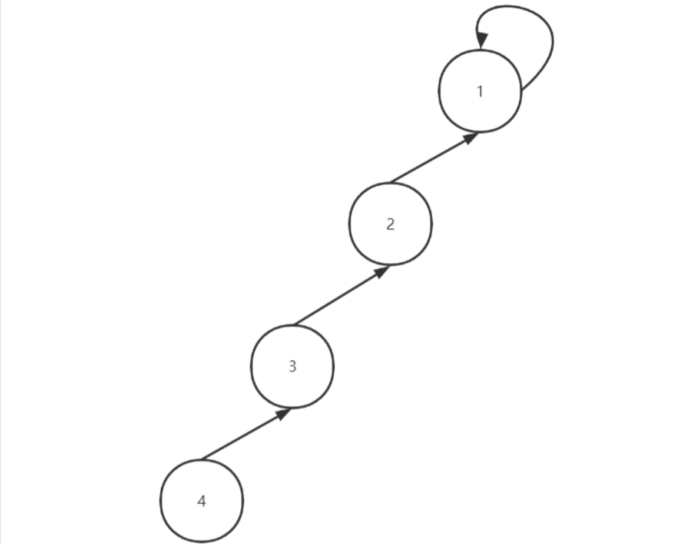
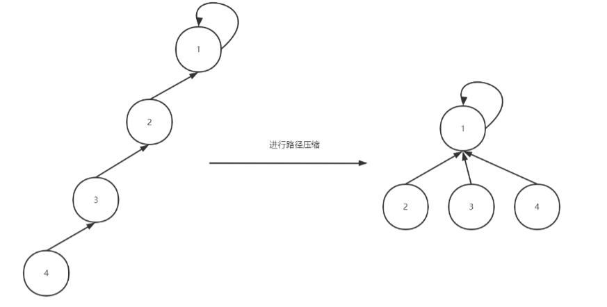

> 前置依赖：数组基础、树的基本概念、递归思想
> 
> 核心目标：高效处理**不相交集合的合并与查询**问题，将原本需要 O (n) 时间的连通性判断优化至**近似常数级**，是图论、动态连通性、最小生成树等算法的核心基础

---

### 📌 核心定义：什么是并查集？

**并查集（Union-Find Set）** 是一种非常精巧而实用的树形数据结构，专门用于处理**不相交集合**的合并与查询问题。

#### 核心概念

- **不相交集合**：两个集合的交集为空集，例如集合 {1,3,5} 和 {2,4,6} 是不相交集合，而 {2,3,5} 和 {1,3,5} 不是
- **动态集合**：并查集维护一组动态变化的不相交集合 S={S₁, S₂, ⋯, Sₖ}，每个元素用整数表示
- **集合代表**：每个集合选出一个元素作为代表，我们不关心具体选哪个元素，只关心能否快速找到元素所在集合的代表

> 🎯 核心设计思想：**只关心连通性，不关心具体路径**。对于任意两个元素，我们只需要知道它们是否在同一个集合中，不需要知道它们之间的具体连接路径。

---

### 🔑 三大基本操作

并查集的所有功能都围绕以下三个核心操作展开：

1. **初始化（MakeSet）**：建立一个新的并查集，包含 s 个单元素集合，每个元素自己构成一个集合
2. **合并（Union）**：将元素 x 和元素 y 所在的两个集合合并为一个集合；若 x 和 y 已在同一集合，则不执行操作
3. **查找（Find）**：找到元素 x 所在集合的代表元素；该操作可用于判断两个元素是否属于同一集合（只需比较它们的代表是否相同）

---

### 📌 实现思路演进：从问题到最优解

#### 1. 为什么不用二维数组？

最初想到的存储方式是用二维数组，每个集合占一行，但存在两个致命问题：

- **空间浪费严重**：如果有 n 个元素，最坏情况下需要 n×n 的空间
- **操作极其繁琐**：合并两个集合需要遍历整行复制元素，时间复杂度 O (n)

因此，我们需要一种更高效的存储方式，**树形结构**应运而生。

---

#### 2. 树形结构表示集合

**核心思想**：用一棵树表示一个集合，树的每个结点对应集合中的一个元素，**树的根结点就是该集合的代表元素**。

- 每个结点存储一个指向父结点的指针
- 根结点的父指针指向自己，表示没有父结点
- 沿着父指针不断向上查找，最终就能找到根结点（集合代表）



> 图中左侧树代表集合 {a,b,c,d}，根结点 a 是集合代表；右侧树代表集合 {e,f,g}，根结点 e 是集合代表。

---

#### 3. 初始状态：单元素森林

初始化时，每个元素都是一个独立的集合，因此形成一个由 n 棵单结点树组成的森林。



> 每个元素的父结点都是自己，每个元素都是自己所在集合的代表。

---

#### 4. 基本查找与合并实现

##### 查找操作

从目标元素开始，沿着父指针不断向上查找，直到找到根结点（父结点等于自己的结点）。

##### 合并操作

1. 分别找到两个元素所在集合的根结点
2. 如果根结点相同，说明已在同一集合，无需合并
3. 如果根结点不同，将其中一个根结点的父指针指向另一个根结点，完成合并

---

#### 5. 问题暴露：链式退化

如果我们依次合并 (4,3)、(3,2)、(2,1)，会形成如下的链式结构：



> 此时查找元素 4 的根结点需要遍历 4→3→2→1，时间复杂度退化为 O (n)，完全失去了树形结构的优势。

---

#### 6. 优化一：路径压缩（Path Compression）

**核心思想**：在每次查找时，顺便将查找路径上的所有结点直接指向根结点，**扁平化树结构**，让后续的查找操作更快。



> 路径压缩后，所有结点都直接指向根结点，下次查找任何元素都只需一步就能找到根。

---

#### 7. 优化二：按秩合并（Union by Rank）

**核心思想**：合并两个集合时，总是将**高度较小的树挂在高度较大的树的根结点下面**，避免树的高度过快增长。

- 用一个`rank`数组记录每个根结点所在树的高度（秩）
- 合并时比较两个根结点的秩：
    
    - 秩小的树挂在秩大的树下面
    - 如果两个树的秩相等，合并后新根的秩加 1
    

> 🎯 双优化效果：路径压缩 + 按秩合并是并查集的黄金组合，能将时间复杂度优化至**近似常数级**。

---

### 🔍 核心操作详解

#### 1. 初始化操作

```cpp
初始化 parent 数组：parent[i] = i （每个元素的父结点是自己）
初始化 rank 数组：rank[i] = 1 （每个集合的初始高度为1）
```

#### 2. 查找操作（带路径压缩）

```cpp
函数 Find(x):
    如果 parent[x] != x:
        parent[x] = Find(parent[x])  // 路径压缩：将当前结点直接挂到根结点下
    返回 parent[x]
```

#### 3. 合并操作（带按秩合并）

```cpp
函数 Union(x, y):
    root_x = Find(x)
    root_y = Find(y)
    
    如果 root_x == root_y:
        返回 （已在同一集合）
    
    如果 rank[root_x] >= rank[root_y]:
        parent[root_y] = root_x
        如果 rank[root_x] == rank[root_y]:
            rank[root_x] += 1
    否则:
        parent[root_x] = root_y
```

#### 4. 连通性判断

```cpp
函数 IsConnected(x, y):
    返回 Find(x) == Find(y)
```

---

### 📊 时间复杂度分析

| 实现方式            | 查找时间复杂度     | 合并时间复杂度     |
| :-------------- | :---------- | :---------- |
| 无优化（链式结构）       | O(n)        | O(n)        |
| 仅路径压缩           | 略大于O(α(n))  | 略大于O(α(n))  |
| 仅按秩合并           | O(logn)     | O(logn)     |
| **路径压缩 + 按秩合并** | **O(α(n))** | **O(α(n))** |

> 🎯 关键说明：α(n) 是**阿克曼函数的反函数**，增长极其缓慢。对于所有实际应用中可能遇到的 n（n≤10¹⁰⁰），α(n)≤5，因此并查集的操作可以认为是**常数时间复杂度**。

---

### 🎯 考研（408）核心考点与考法

#### ⚠️ 选择题高频秒杀考点

1. **核心性质**：并查集用树表示集合，根结点是集合代表
2. **路径压缩**：查找时将路径上的结点直接指向根结点，扁平化树结构
3. **按秩合并**：小树挂大树，防止树退化，保证树高稳定在 O (logn)
4. **时间复杂度**：双优化后为 O (α(n))，近似常数级
5. **应用场景**：动态连通性、最小生成树（Kruskal 算法）、朋友圈问题

#### ✅ 大题核心考法

1. **手动模拟**：给定一系列合并和查找操作，手动模拟并查集的变化过程
2. **代码实现**：写出带路径压缩和按秩合并的并查集核心代码
3. **算法应用**：用并查集解决实际问题，如判断图的连通性、求连通分量个数

#### 🚫 考研避坑技巧

1. 路径压缩只改变查找路径上结点的父指针，不改变树的秩
2. 按秩合并只在合并两个根结点时执行，非根结点的秩无意义
3. 并查集不支持删除操作，这是其核心局限性
4. 元素编号通常从 1 开始，数组大小要预留足够空间

---

### 💻 工程化代码实现（C++ 面向对象）

> 设计哲学：接口与实现分离，对外接口负责边界校验，内部辅助函数专注核心逻辑；严格遵循 C++ 工程规范，保证内存安全、异常安全。

```cpp
#include <iostream>
#include <stdexcept>
#include <format>
#include <algorithm> // 为std::max提供头文件

// 并查集命名空间：封装 按秩合并 + 路径压缩 标准实现
namespace union_find {
    // 并查集类：维护集合的查找、合并、连通性判断
    class UnionFind {
    private:
        int* parent_;  // 父节点数组：parent_[i] 存储元素 i 的父节点
        int* rank_;    // 秩数组：rank_[i] 存储以 i 为根的集合高度（按秩合并依据）
        int size_;     // 并查集总元素个数（元素编号：1 ~ size_）

    public:
        // 构造函数：初始化 n 个元素的并查集
        // 异常：n 非正数时抛出非法参数异常
        UnionFind(int n) {
            if (n <= 0) {
                throw std::invalid_argument("Invalid size (must be a positive integer).");
            }
            Init(n);  // 调用初始化辅助函数完成数组分配与赋值
        }

        // 析构函数：释放动态分配的数组内存，避免内存泄漏
        ~UnionFind() {
            delete[] parent_;
            delete[] rank_;
            parent_ = nullptr;
            rank_ = nullptr;
        }

        // 禁用拷贝构造 + 赋值重载：防止浅拷贝导致的重复释放内存问题
        UnionFind(const UnionFind&) = delete;
        UnionFind& operator=(const UnionFind&) = delete;

        // 对外查找接口：查找元素 x 的根节点
        // 异常：元素越界时抛出非法参数异常
        int Find(int x) {
            if (!IsValid(x)) {
                throw std::invalid_argument(std::format("Find failed: {} is out of range.", x));
            }
            return FindHelper(x);  // 调用底层辅助函数执行路径压缩查找
        }

        // 对外合并接口：合并 x 和 y 所在的两个集合
        // 异常：元素越界时抛出非法参数异常
        void Union(int x, int y) {
            if (!IsValid(x) || !IsValid(y)) {
                throw std::invalid_argument(std::format("Union failed: {} or {} is out of range.", x, y));
            }

            // 查找两个元素的根节点
            int root_x = FindHelper(x);
            int root_y = FindHelper(y);

            // 同一集合：无需合并，打印警告信息
            if (root_x == root_y) {
                std::cerr << std::format("Warning: {} and {} are already in the same set.\n", x, y);
                return;
            }

            // 调用底层辅助函数执行按秩合并
            UnionHelper(root_x, root_y);
        }

        // 对外连通性判断接口：判断 x 和 y 是否在同一个集合
        // 异常：元素越界时抛出非法参数异常
        bool IsConnected(int x, int y) {
            // 边界校验：判断元素编号是否合法
            if (!IsValid(x) || !IsValid(y)) {
                throw std::invalid_argument(std::format("IsConnected failed: {} or {} is out of range.", x, y));
            }
            // 根节点相同 → 同一集合
            return FindHelper(x) == FindHelper(y);
        }

    private:
        // 初始化辅助函数：分配内存 + 初始化父节点和秩
        void Init(int n) {
            size_ = n;
            parent_ = new int[n + 1];  // 数组下标从 1 开始，适配题目常规编号
            rank_ = new int[n + 1];

            // 初始状态：每个元素的父节点是自己，集合高度为 1
            for (int i = 1; i <= n; i++) {
                parent_[i] = i;
                rank_[i] = 1;
            }
        }

        // 查找辅助函数：递归实现 + 路径压缩（核心优化）
        // 功能：查找根节点，同时将当前节点直接挂到根节点下，扁平化树结构
        int FindHelper(int x) noexcept {
            /* 递归展开写法（便于理解）
            if (parent_[x] == x) {
                return x;
            }
            // 递归查找父节点的根节点
            int root = FindHelper(parent_[x]);
            // 路径压缩：将当前节点直接挂载到根节点下
            parent_[x] = root;
            return root;
            */
            // 三目运算符精简写法：路径压缩核心逻辑
            // 情况1：当前节点的父节点是自己 --> 已找到根节点，直接返回
            // 情况2：当前节点的父节点不是根节点 
            // --> 递归查找父节点的根节点，**将当前节点直接挂载到根节点下（路径压缩）**，再返回根节点
            return parent_[x] == x ?
                x : parent_[x] = FindHelper(parent_[x]);
        }

        // 合并辅助函数：按秩合并（核心优化：小树挂大树，防止树退化）
        void UnionHelper(int root_x, int root_y) noexcept {
            // 规则：秩大的作为父节点，秩小的挂在下面
            if (rank_[root_x] >= rank_[root_y]) {
                parent_[root_y] = root_x;
                // 秩相等时，合并后新根的秩 +1（因为两棵树高度相同，合并后高度增加1）
                if (rank_[root_x] == rank_[root_y]) {
                    rank_[root_x]++;
                }
            }
            else {
                parent_[root_x] = root_y;
                // root_y的秩更大，合并后高度不变，无需更新
            }
        }

        // 合法性校验辅助函数：判断元素 x 是否在有效编号范围内
        bool IsValid(int x) const noexcept {
            return x >= 1 && x <= size_;
        }
    };

    // 并查集测试函数：验证 初始化、合并、查找、连通性判断 功能
    void RunTest() {
        std::cout << "UnionFind implementation (Union by Rank + Path Compression):" << std::endl;
        try {
            UnionFind uf(10);    // 初始化 10 个元素：1~10
            // 开启布尔值文字输出（true/false，不是1/0）
            std::cout << std::boolalpha;

            uf.Union(1, 2);     // 合并集合{1}和{2} → {1,2}
            uf.Union(2, 3);     // 合并集合{1,2}和{3} → {1,2,3}
            uf.Union(4, 5);     // 合并集合{4}和{5} → {4,5}

            // 连通性测试
            std::cout << std::format("1 and 3 connected: {}\n", uf.IsConnected(1, 3));  // true
            std::cout << std::format("1 and 5 connected: {}\n", uf.IsConnected(1, 5));  // false

            // 查找根节点测试
            std::cout << std::format("Root of 3: {}\n", uf.Find(3));
            std::cout << std::format("Root of 5: {}\n", uf.Find(5));

            uf.Union(3, 4);     // 合并集合{1,2,3}和{4,5} → {1,2,3,4,5}
            std::cout << std::format("1 and 5 connected now: {}\n", uf.IsConnected(1, 5)); // true

        }
        // 捕获所有标准异常，打印错误信息
        catch (const std::exception& e) {
            std::cerr << "Error: " << e.what() << std::endl;
        }
    }
}

// 主函数：程序入口
int main() // 12
{
    union_find::RunTest();

    return 0;
}
```

---

### 📝 核心笔记重点

1. 🔴 **核心定义**：并查集是处理不相交集合合并与查询的树形数据结构
2. 🔴 **基本操作**：初始化、合并、查找、连通性判断
3. 🔴 **两大优化**：路径压缩（扁平化树结构）、按秩合并（防止树退化）
4. 🔴 **时间复杂度**：双优化后为 O (α(n))，近似常数级，是效率最高的数据结构之一
5. 🔴 **核心思想**：只关心连通性，不关心具体路径
6. 🔴 **考研重点**：手动模拟操作过程、核心代码实现、算法应用场景