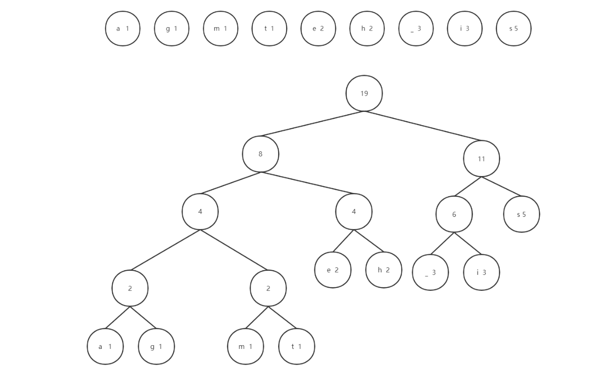

> 前置依赖：二叉树基本定义、树的路径长度概念、贪心算法思想
> 
> 核心目标：构造**带权路径长度（WPL）最小**的二叉树（最优二叉树），并基于此生成**无前缀变长编码**，实现数据的无损压缩，是现代压缩算法（ZIP、JPEG、MP3）的核心基础

---

### 📌 核心概念铺垫

在理解哈夫曼树之前，必须先掌握以下四个无歧义的基础概念：

1. **结点的路径长度**：从根结点到该结点的路径上所经过的**边数**
2. **树的路径长度**：所有**叶子结点**的路径长度之和（部分资料称为 "外路径长度"）
3. **结点的带权路径长度**：结点的路径长度 × 该结点的权值
4. **树的带权路径长度（WPL）**：所有**叶子结点**的带权路径长度之和，公式：
    $$WPL = \sum_{i=1}^{n} w_i \times l_i$$
    其中 wi​ 是第 i 个叶子结点的权值，li​ 是第 i 个叶子结点的路径长度

> 🎯 核心结论：WPL 是衡量二叉树 "优劣" 的唯一标准，WPL 越小，树的性能越好。

---

### 📌 哈夫曼树（最优二叉树）定义

**哈夫曼树（Huffman Tree）**，又称**最优二叉树**，是指：给定 n 个带权值的结点，将这 n 个结点全部作为叶子结点，构造一棵二叉树，使得该树的**带权路径长度（WPL）最小**。

---

### 🔍 问题 1：哈夫曼树要满足哪些条件才能实现 WPL 最小？原因是什么？证明它

#### 哈夫曼树必须满足的三个核心条件

1. **所有给定结点必须是叶子结点**
2. **树中不存在度为 1 的结点（n₁=0）**
3. **权值越大的叶子结点，离根结点越近；权值越小的叶子结点，离根结点越远**

#### 证明：为什么这三个条件能保证 WPL 最小

我们用**反证法**和**二叉树性质**来证明：

##### 证明 1：所有给定结点必须是叶子结点

假设存在一个给定的权值结点是内部结点（非叶子），那么它必然有孩子结点。此时，我们可以将这个内部结点替换为它的孩子结点，将原内部结点的权值分配给孩子结点，这样树的 WPL 一定会减小。因为孩子结点的路径长度比父结点大 1，但权值之和不变，WPL 会增加权值 ×1，这与 WPL 最小矛盾。因此，所有给定结点必须是叶子结点。

##### 证明 2：不存在度为 1 的结点

假设存在一个度为 1 的结点，那么它只有一个孩子结点。此时，我们可以直接将这个孩子结点提升为该结点父结点的孩子，删除这个度为 1 的结点。这样，原孩子结点的路径长度减小 1，WPL 会减小该孩子结点的权值 ×1，这与 WPL 最小矛盾。因此，哈夫曼树中 n₁=0。

##### 证明 3：权值大的结点离根更近

假设存在两个叶子结点 A 和 B，权值 w_A > w_B，但 A 的路径长度 l_A > l_B。此时，我们交换 A 和 B 的位置，WPL 的变化为：

>$$\Delta WPL = (w_A \times l_B + w_B \times l_A) - (w_A \times l_A + w_B \times l_B) = (w_A - w_B)(l_B - l_A) < 0$$

即交换后 WPL 减小，这与原树是最优二叉树矛盾。因此，权值越大的结点，路径长度必须越小（离根越近）。

#### 哈夫曼树的衍生性质

由上述三个条件，结合二叉树的性质（n₀ = n₂ + 1），可以推导出：

- 哈夫曼树的总结点数 = 2n - 1（n 为叶子结点数）
- 哈夫曼树的非叶子结点数 = n - 1
- 哈夫曼树不唯一（当两个结点权值相等时，左右孩子可以互换），但**WPL 一定唯一**

---

### 🔄 哈夫曼树的构造算法（哈夫曼算法）

#### 算法步骤

1. **初始化森林**：将 n 个带权值的叶子结点看作 n 棵独立的二叉树，构成一个森林
2. **合并最小树**：每次从森林中选择**根结点权值最小的两棵树**进行合并，生成一个新的根结点，新根结点的权值为两棵子树根结点权值之和
3. **重复合并**：将新生成的树放回森林，重复步骤 2，直到森林中只剩下一棵树
4. **完成构造**：最终剩下的这棵树就是哈夫曼树

---

### 🔍 问题 2：为什么哈夫曼算法可以造出哈夫曼树？构造过程满足哪些条件？

哈夫曼算法是一种**贪心算法**，它每次都做出当前最优的选择（合并两个权值最小的树），最终得到全局最优解。

#### 哈夫曼算法满足哈夫曼树的所有条件

1. **所有给定结点都是叶子结点**：算法中，只有初始的 n 个结点会作为叶子结点，所有新生成的结点都是内部结点
2. **不存在度为 1 的结点**：每次合并都是两棵树合并为一棵，新生成的结点一定有两个孩子，因此所有内部结点的度都是 2
3. **权值大的结点离根更近**：每次合并的都是当前权值最小的两个结点，因此权值越小的结点，被合并的次数越多，路径长度越长；权值越大的结点，被合并的次数越少，路径长度越短

#### 贪心选择性质证明

哈夫曼算法的正确性基于**贪心选择性质**和**最优子结构性质**：

- **贪心选择性质**：存在一个最优解，包含了当前的贪心选择（合并两个最小权值的树）
- **最优子结构性质**：一个问题的最优解包含了其子问题的最优解

因此，哈夫曼算法每次合并两个最小权值的树，最终得到的一定是 WPL 最小的哈夫曼树。

---

### 📌 哈夫曼编码

哈夫曼编码是哈夫曼树最经典的应用，用于实现**数据的无损压缩**。

#### 编码方式对比

|编码方式|定义|优点|缺点|
|:--|:--|:--|:--|
|**定长编码**|每个字符对应的二进制编码长度相同（如 ASCII 码 8bit，Unicode16bit）|简单易实现，解码方便|空间浪费严重，所有字符占用相同空间|
|**变长编码**|每个字符对应的二进制编码长度不同，出现频率高的字符编码短，频率低的字符编码长|编码长度短，空间利用率高|需要满足前缀属性，否则解码会有歧义|

哈夫曼编码是目前应用最广泛的最优变长编码，下面我们通过一个完整的工业级示例，演示从原始文本到哈夫曼树再到哈夫曼编码的全流程：


我们以真实文本 `this is his message` 为例，第一步先统计每个字符的出现频率，得到如下权值表：

|字符|a|g|m|t|e|h|空格|i|s|
|:--|:--|:--|:--|:--|:--|:--|:--|:--|:--|
|频率|1|1|1|1|2|2|3|3|5|

第二步：按照哈夫曼算法，每次选择两个权值最小的结点合并，9 个叶子结点共需要执行 8 次合并，最终得到如下的最优哈夫曼树：



我们可以验证这棵树的最优性，计算其带权路径长度 WPL：

> $$WPL=(1+1+1+1)×4+(2+2+3+3)×3+5×1=16+30+5=51$$

这是所有可能的二叉树中 WPL 的最小值，符合哈夫曼树的定义。

第三步：根据哈夫曼树生成每个字符的哈夫曼编码。在生成编码之前，我们先明确哈夫曼编码树的三个核心特征，这是理解哈夫曼编码正确性和唯一性的基础：


#### 前缀属性

变长编码必须满足**前缀属性**：**任何一个字符的编码，都不能是另一个字符编码的前缀**。只有满足前缀属性，才能在解码时唯一确定每个字符。

---

### 🔍 问题 3：为什么哈夫曼树可用于构造变长编码？为什么它能保证无重复前缀？

#### 为什么哈夫曼树适合构造变长编码

哈夫曼树完美契合变长编码的需求：

- 权值大（出现频率高）的字符离根近，编码短
- 权值小（出现频率低）的字符离根远，编码长
- 这样可以使整个文本的平均编码长度最短，达到最优压缩效果

#### 为什么哈夫曼编码满足前缀属性

哈夫曼编码的生成规则是：**从根结点到叶子结点的路径上，往左走标 1，往右走标 0（或反之），路径上的二进制序列就是该叶子结点对应的编码**。

由于哈夫曼树中**所有字符都是叶子结点**，且**没有一个叶子结点是另一个叶子结点的祖先**，因此：

- 任何一个叶子结点的路径，都不会是另一个叶子结点路径的前缀
- 对应的编码自然满足前缀属性，解码时不会有歧义

---

### 🔍 问题 4：为什么代码实现上要从叶子结点往上回溯到根结点来生成哈夫曼编码？

在我们的数组存储实现中，采用从叶子到根的回溯方式生成编码，主要有以下三个原因：

1. **存储结构决定**：我们的哈夫曼树采用**数组存储**，每个结点只存储了**父结点指针**，没有存储孩子结点的指针（或者说孩子指针只在构建树时使用）。因此，从叶子结点通过父指针向上遍历到根结点，是最直接、最高效的方式。
    
2. **编码长度不确定**：哈夫曼编码是变长编码，不同字符的编码长度不同。如果从根结点往下遍历生成编码，需要动态分配内存存储编码，实现复杂。而从叶子往上遍历，我们可以预先分配一个最大长度为 n 的临时数组（最长编码长度不超过 n-1），存储倒序的编码，最后再反转得到正序编码，实现简单且高效。
    
3. **避免递归开销**：从根往下遍历生成编码需要使用递归，对于大规模数据会有栈溢出的风险。而从叶子往上遍历是迭代实现，没有递归开销，稳定性更高。
    

> 🎯 注意：从叶子往上生成的编码是**倒序**的，因此需要将临时数组中的编码反转后，才是最终的哈夫曼编码。

---

### 🎯 考研（408）核心考点与考法

#### ⚠️ 选择题高频秒杀考点

1. **WPL 计算**：给定权值序列，计算哈夫曼树的 WPL
2. **哈夫曼树特性**：总结点数 = 2n-1，无度为 1 的结点，权值大的结点离根近
3. **哈夫曼编码长度**：给定权值序列，计算某个字符的哈夫曼编码长度
4. **前缀属性判断**：判断一组编码是否是前缀编码
5. **哈夫曼树唯一性**：哈夫曼树不唯一，但 WPL 唯一

#### ✅ 大题核心考法

1. **手动构造哈夫曼树**：给定权值序列，画出哈夫曼树的构造过程
2. **生成哈夫曼编码**：基于构造的哈夫曼树，生成每个字符的哈夫曼编码
3. **计算压缩率**：对比定长编码和哈夫曼编码的总长度，计算压缩率
4. **算法应用**：用哈夫曼树解决实际问题，如文件压缩、最优合并问题

#### 🚫 考研避坑技巧

1. 哈夫曼树的叶子结点数一定是给定的权值个数，不要把内部结点算进去
2. 计算 WPL 时，只计算叶子结点的带权路径长度，不要算内部结点
3. 哈夫曼编码的左右标记可以互换（左 0 右 1 或左 1 右 0），因此编码不唯一，但长度唯一
4. 当两个结点权值相等时，左右孩子可以互换，因此哈夫曼树不唯一

---

### 📊 时间复杂度分析

|操作|时间复杂度|说明|
|:--|:--|:--|
|哈夫曼树构造（数组实现）|O(n²)|每次找两个最小结点需要 O (n) 时间，共执行 n-1 次|
|哈夫曼树构造（堆实现）|O(nlogn)|用最小堆找两个最小结点需要 O (logn) 时间，共执行 n-1 次|
|哈夫曼编码生成|O(n)|每个叶子结点遍历到根结点的平均路径长度为 O (logn)，总时间 O (nlogn)≈O (n)|

> 🎯 工程优化：实际工程中，通常使用 ** 最小堆（优先队列）** 来实现哈夫曼算法，将时间复杂度从 O (n²) 优化至 O (nlogn)。

---

### 💻 工程化代码实现（C++ 面向对象）

> 设计哲学：基于数组存储结构实现，接口与实现分离，对外接口负责边界校验，内部辅助函数专注核心逻辑；严格遵循 C++ 工程规范，保证内存安全、异常安全。

```cpp
#include <iostream>
#include <format>
#include <stdexcept>
#include <cstring>
using namespace std;

// 哈夫曼树命名空间：封装哈夫曼树与哈夫曼编码的所有实现
namespace huffman_tree {
    // 哈夫曼树类：基于数组存储结构实现，支持构建树、生成编码、查询编码
    class HuffmanTree {
    private:
        // 哈夫曼树节点结构体：数组存储的核心单元
        struct Node {
            int weight;   // 节点权值（叶子节点为字符权重，非叶子为子节点权重和）
            int father;   // 父节点下标，-1表示无父节点（根节点）
            int left;     // 左孩子下标，-1表示无左孩子
            int right;    // 右孩子下标，-1表示无右孩子

            // 节点构造函数：初始化默认值，无异常
            Node() noexcept : weight(0), father(-1), left(-1), right(-1) {}
        };

        // 核心成员变量
        Node* tree_;          // 动态数组：存储整棵哈夫曼树的所有节点
        char* chars_;         // 动态数组：存储待编码的原始字符
        int* weights_;        // 动态数组：存储字符对应的权值
        char** codes_;        // 二级动态数组：存储每个字符的哈夫曼编码
        int leaf_count_;      // 叶子节点数量（即待编码的字符个数）
        int total_count_;     // 哈夫曼树总节点数 = 2*叶子节点数 - 1

    public:
        // 默认构造函数：初始化空哈夫曼树，所有指针置空，计数归零
        HuffmanTree() noexcept
            : tree_(nullptr),
            chars_(nullptr),
            weights_(nullptr),
            codes_(nullptr),
            leaf_count_(0),
            total_count_(0) {
        }

        // 析构函数：释放所有动态分配的内存
        // 【设计哲学】多级指针内存释放遵循「先内层后外层、先二级后一级」原则
        // 防止内存泄漏；指针置空+变量归零是防御性编程，杜绝野指针与重复释放风险
        ~HuffmanTree() noexcept {
            // 第一步：释放二级内存 → 逐个释放每个字符的编码字符串
            for (int i = 0; i < leaf_count_; i++) {
                delete[] codes_[i];
                codes_[i] = nullptr;
            }

            // 第二步：释放一级内存 → 释放编码数组、树节点、字符/权值数组
            delete[] codes_;
            delete[] tree_;
            delete[] chars_;
            delete[] weights_;

            // 第三步：防御性重置 → 所有指针置空，计数归零
            codes_ = nullptr;
            tree_ = nullptr;
            chars_ = nullptr;
            weights_ = nullptr;
            leaf_count_ = 0;
            total_count_ = 0;
        }

        // 禁用拷贝构造/赋值重载：避免浅拷贝导致的内存重复释放崩溃
        HuffmanTree(const HuffmanTree&) = delete;
        HuffmanTree& operator=(const HuffmanTree&) = delete;

        // 对外接口：构建哈夫曼树
        // 参数：字符数组、权值数组、字符数量
        void BuildTree(const char chars[], const int weights[], int n) {
            // 合法性校验：禁止重复构建树
            if (tree_ != nullptr) {
                throw std::runtime_error("Huffman tree already built.");
            }
            // 合法性校验：字符数必须为正
            if (n <= 0) {
                throw std::invalid_argument("Invalid leaf count (must be a positive integer).");
            }
            // 合法性校验：输入数组不能为空指针
            if (chars == nullptr || weights == nullptr) {
                throw std::invalid_argument("Input arrays cannot be null pointers.");
            }

            // 初始化树的节点数量
            leaf_count_ = n;
            total_count_ = 2 * leaf_count_ - 1;

            // 分配内存，拷贝输入的字符和权值数据
            chars_ = new char[leaf_count_];
            weights_ = new int[leaf_count_];
            for (int i = 0; i < leaf_count_; i++) {
                chars_[i] = chars[i];
                weights_[i] = weights[i];
            }

            // 核心流程：构建哈夫曼树 → 生成哈夫曼编码
            BuildTreeHelper();
            GenerateCodesHelper();
        }

        // 对外接口：打印所有字符及其对应的哈夫曼编码
        void PrintCodes() const noexcept {
            if (leaf_count_ == 0) {
                std::cerr << "Empty tree, no codes to print." << std::endl;
                return;
            }
            for (int i = 0; i < leaf_count_; ++i) {
                std::cout << std::format("{}: {}\n", chars_[i], codes_[i]);
            }
        }

        // 对外接口：根据下标获取对应字符的哈夫曼编码
        const char* GetCodes(int index) const {
            // 下标越界校验
            if (index < 0 || index >= leaf_count_) {
                throw std::out_of_range(std::format("Index {} is out of range [0, {}].", index, leaf_count_ - 1));
            }
            return codes_[index];
        }

    private:
        // 核心辅助函数：在[0, max_index]范围内查找两个权值最小的根节点
        // 输出：s1=最小节点下标，s2=次小节点下标
        void FindMinTwoRootsHelper(int max_index, int& s1, int& s2) const noexcept {
            // 查找第一个最小权值节点
            int min_idx = 0;
            for (int i = 0; i <= max_index; i++) {
                if (tree_[i].father == -1) {
                    min_idx = i;
                    break;
                }
            }
            for (int i = 0; i <= max_index; i++) {
                if (tree_[i].father == -1 && tree_[i].weight < tree_[min_idx].weight) {
                    min_idx = i;
                }
            }
            s1 = min_idx;

            // 查找第二个最小权值节点（排除已找到的s1）
            min_idx = 0;
            for (int i = 0; i <= max_index; i++) {
                if (tree_[i].father == -1 && i != s1) {
                    min_idx = i;
                    break;
                }
            }
            for (int i = 0; i <= max_index; i++) {
                if (i != s1 && tree_[i].father == -1 && tree_[i].weight < tree_[min_idx].weight) {
                    min_idx = i;
                }
            }
            s2 = min_idx;
        }

        // 核心函数：构建哈夫曼树（合并最小节点，生成完整树结构）
        void BuildTreeHelper() {
            // 分配总节点数组内存
            tree_ = new Node[total_count_];

            // 初始化叶子节点权值
            for (int i = 0; i < leaf_count_; i++) {
                tree_[i].weight = weights_[i];
            }

            // 循环合并节点：从叶子节点后开始，生成所有非叶子节点
            for (int i = leaf_count_; i < total_count_; i++) {
                int s1, s2;
                // 找到两个最小权值的根节点
                FindMinTwoRootsHelper(i - 1, s1, s2);

                // 建立父子关系：将两个最小节点作为当前节点的孩子
                tree_[i].left = s1;
                tree_[i].right = s2;
                // 非叶子节点权值 = 两个子节点权值之和
                tree_[i].weight = tree_[s1].weight + tree_[s2].weight;

                // 更新子节点的父节点下标
                tree_[s1].father = tree_[s2].father = i;
            }
        }

        // 核心函数：生成哈夫曼编码（左1右0，从叶子节点向上遍历至根节点）
        void GenerateCodesHelper() {
            // 临时数组：存储单个字符的编码（倒序），最大长度为leaf_count_
            char* temp_code = new char[leaf_count_];
            // 分配编码二级数组内存
            codes_ = new char* [leaf_count_];

            // 遍历所有叶子节点（每个字符）
            for (int i = 0; i < leaf_count_; i++) {
                // 编码起始位置：从临时数组尾部开始存储（倒序生成）
                int start = leaf_count_ - 1;
                temp_code[start] = '\0';

                // 遍历起点：当前叶子节点
                int current = i;
                // 父节点下标
                int parent = tree_[current].father;
                // 向上遍历直到根节点（父节点为-1）
                while (parent != -1) {
                    start--;
                    // 编码规则：左孩子=1，右孩子=0（可互换为左0右1）
                    if (tree_[parent].left == current) {
                        temp_code[start] = '1';
                    }
                    else {
                        temp_code[start] = '0';
                    }
                    // 向上移动节点
                    current = parent;
                    parent = tree_[parent].father;
                }
                // 计算编码长度：从start到字符串结束符的长度
                int code_len = leaf_count_ - start;
                // 分配编码内存
                codes_[i] = new char[code_len];
                // 手动拷贝编码字符串（从临时数组的start位置开始）
                int copy_pos = 0;
                while (temp_code[start + copy_pos] != '\0') {
                    codes_[i][copy_pos++] = temp_code[start + copy_pos];
                }
                // 添加字符串结束符
                codes_[i][copy_pos] = '\0';
            }

            // 释放临时数组，避免内存泄漏
            delete[] temp_code;
            temp_code = nullptr;
        }
    };

    // 测试函数：提供交互式输入，验证哈夫曼树功能
    void runTest() {
        std::cout << "Huffman Tree and Huffman Coding implementation:" << std::endl;
        try {
            // 创建空哈夫曼树对象
            HuffmanTree huffman;

            int n;
            std::cout << "Enter the number of characters: ";
            if (!(std::cin >> n) || n <= 0) {
                throw std::invalid_argument("Invalid character count.");
            }
            // 忽略缓冲区换行符
            std::cin.ignore();

            // 存储待编码字符
            char chars[105];
            std::cout << "Enter " << n << " characters (including spaces): ";
            for (int i = 0; i < n; ++i) {
                chars[i] = std::cin.get();
            }

            // 存储字符对应权值
            int weights[105];
            std::cout << "Enter " << n << " weights: ";
            for (int i = 0; i < n; ++i) {
                if (!(std::cin >> weights[i])) {
                    throw std::runtime_error("Failed to read weight.");
                }
            }

            // 构建哈夫曼树并生成编码
            huffman.BuildTree(chars, weights, n);
            std::cout << "\nGenerated Huffman Codes:\n";
            // 打印编码结果
            huffman.PrintCodes();

        }
        // 捕获所有异常并输出
        catch (const std::exception& e) {
            std::cerr << "Error: " << e.what() << std::endl;
        }
    }
}

/*
测试用例输入：
9
agmteh is
1 1 1 1 2 2 3 3 5
*/
int main() { // 13
    // 执行哈夫曼树测试
    huffman_tree::runTest();

    return 0;
}
```

---

### 📝 核心笔记重点

1. 🔴 **核心定义**：哈夫曼树是 WPL 最小的二叉树，哈夫曼编码是基于哈夫曼树的无前缀变长编码
2. 🔴 **三大条件**：所有给定结点是叶子、无度为 1 的结点、权值大的离根近
3. 🔴 **哈夫曼算法**：每次合并两个最小权值的树，共合并 n-1 次
4. 🔴 **前缀属性**：哈夫曼编码满足前缀属性，因为所有字符都是叶子结点
5. 🔴 **编码生成**：从叶子结点往上回溯生成编码，倒序后得到最终编码
6. 🔴 **时间复杂度**：数组实现 O (n²)，堆实现 O (nlogn)
7. 🔴 **考研重点**：手动构造哈夫曼树、计算 WPL、生成哈夫曼编码