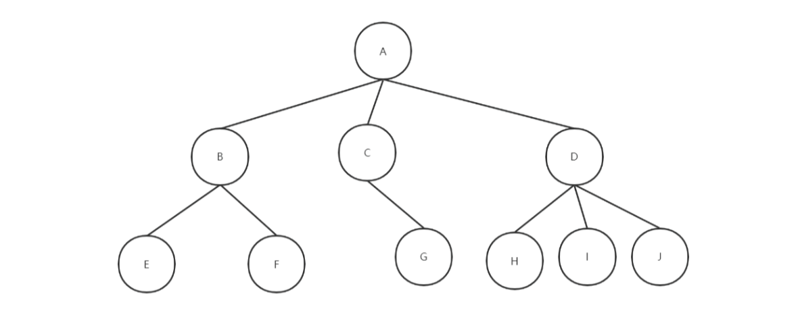
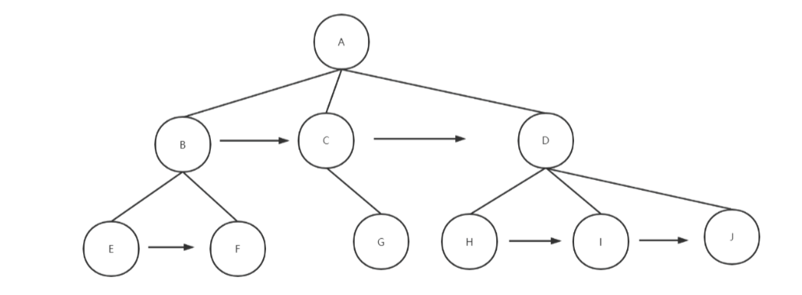
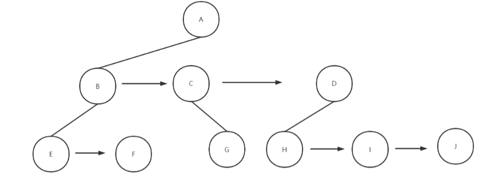
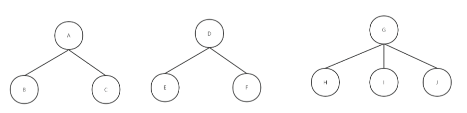
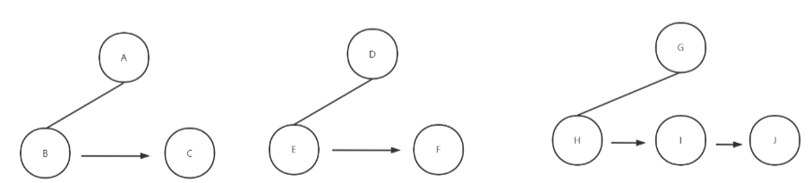
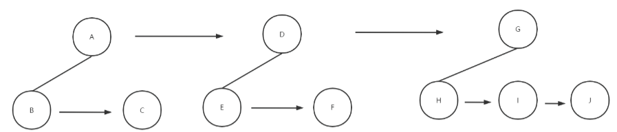
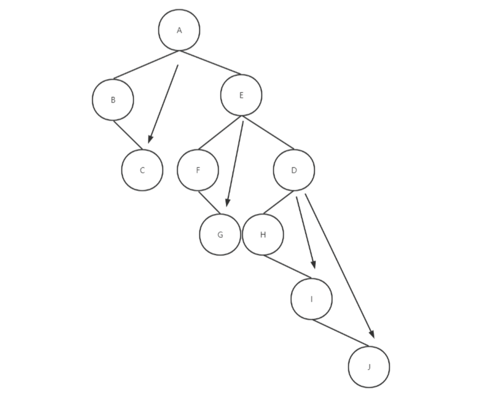

> 前置依赖：树的基本概念、二叉树的基本定义与存储
> 
> 核心目标：掌握**树→二叉树**、**森林→二叉树**、**二叉树→树 / 森林**的标准转化方法，理解 “左孩子右兄弟” 的核心思想，明确转化前后的结构与遍历对应关系，是解决树与森林遍历、存储问题的核心基础。

---

### 📌 核心定义与转化意义

- **普通树**：每个结点可以有任意多个孩子，结构灵活但存储和操作复杂，没有统一的遍历算法
- **森林**：由 m（m≥0）棵互不相交的树组成的集合
- **转化的核心思想**：**左孩子右兄弟表示法**。将任意树 / 森林转化为唯一的二叉树，从而可以利用二叉树成熟的存储结构和算法来处理树与森林的问题。

> 🎯 关键结论：**任何一棵树 / 森林都可以唯一地转化为一棵二叉树；反之，任何一棵二叉树也可以唯一地转化为一棵树或森林**。

---

### 🔄 一、普通树转化为二叉树（核心基础）

#### 核心规则：左孩子右兄弟

- 对于任意结点，**第一个孩子作为它的左孩子**
- **右边的兄弟作为它的右孩子**

#### 三步标准转化法

我们以下面这棵普通树为例，演示完整的转化过程：

##### 步骤 1：加兄弟连线

在所有**相邻的兄弟结点**之间加一条水平连线。

- 结点 B、C、E 是兄弟，加 B→C、C→E 连线
- 结点 F、D 是兄弟，加 F→D 连线
- 结点 G、H 是兄弟，加 G→H 连线
- 结点 I、J 是兄弟，加 I→J 连线

##### 步骤 2：删多余父子连线

对于每个结点，只保留它与**第一个孩子**的连线，删除它与其他所有孩子的连线。

- 删除 A 与 C、A 与 E 的连线（只保留 A 与 B）
- 删除 E 与 D 的连线（只保留 E 与 F）
- 删除 D 与 H 的连线（只保留 D 与 G）
- 删除 H 与 I 的连线（只保留 H 与... 按原图结构对应删除）

##### 步骤 3：旋转调整

以根结点为轴，将整棵树**顺时针旋转 45 度**，调整为标准的二叉树层次结构。

- 原来的水平兄弟连线变为右孩子连线
- 原来的垂直父子连线变为左孩子连线
#### 转化后的核心特性

1. 转化后的二叉树**根结点没有右孩子**（因为原树只有一个根，没有兄弟）
2. 原树中结点的**第一个孩子** → 二叉树中该结点的**左孩子**
3. 原树中结点的**下一个兄弟** → 二叉树中该结点的**右孩子**
4. 转化前后**结点总数不变**，**边数不变**

---

### 🔄 二、森林转化为二叉树

森林是多棵树的集合，转化为二叉树的过程是树转二叉树的扩展。

#### 两步标准转化法

我们以包含 3 棵树的森林为例，演示转化过程：

- 第一棵树：根 A，孩子 B、C
- 第二棵树：根 D，孩子 E、F
- 第三棵树：根 G，孩子 H、I、J

##### 步骤 1：每棵树单独转二叉树

将森林中的**每一棵树分别按照 “树转二叉树” 的方法**，转化为各自的二叉树。

- 第一棵树转二叉树：A 为根，左孩子 B，B 的右孩子 C
- 第二棵树转二叉树：D 为根，左孩子 E，E 的右孩子 F
- 第三棵树转二叉树：G 为根，左孩子 H，H 的右孩子 I，I 的右孩子 J

##### 步骤 2：根节点连兄弟

将所有二叉树的**根结点视为兄弟结点**，从左到右依次用右孩子连线连接起来。

- 第一棵树的根 A 的右孩子 → 第二棵树的根 D
- 第二棵树的根 D 的右孩子 → 第三棵树的根 G

##### 最终结果

调整层次结构，得到森林转化后的唯一二叉树。

#### 转化后的核心特性

1. 转化后的二叉树**根结点有右孩子**（因为森林有多棵树，根之间是兄弟）
2. 第 i 棵树的根结点 → 二叉树中第 i-1 棵树根结点的**右孩子**
3. 每棵树内部的结构保持 “左孩子右兄弟” 的对应关系
4. 转化前后**结点总数不变**，**边数不变**

---

### 🔄 三、二叉树转化为树 / 森林（逆过程）

二叉树转树或森林是上述过程的逆操作，核心规则是**左孩子变孩子，右孩子变兄弟**。

#### 三步标准转化法

1. **加父子连线**：对于任意结点，如果它有左孩子，那么将左孩子的所有右子孙都作为该结点的孩子，用连线连接
2. **删右孩子连线**：删除二叉树中所有的右孩子连线
3. **调整层次**：将结点按层次排列，形成树或森林的结构

#### 如何判断对应树还是森林？

- 如果二叉树的**根结点没有右孩子** → 转化为**一棵树**
- 如果二叉树的**根结点有右孩子** → 转化为**森林**（右孩子的个数 + 1 就是森林中树的棵数）

#### 逆转化的核心特性

1. 转化是唯一的，与原转化过程互逆
2. 转化前后结点总数、边数不变
3. 原二叉树的左子树 → 对应树的第一棵子树
4. 原二叉树的右子树 → 对应森林中其他的树

---

### 🎯 核心性质与考研（408）高频考点

#### 1. 转化前后的数量关系

- 结点数：树 / 森林的结点数 = 转化后二叉树的结点数
- 边数：树 / 森林的边数 = 转化后二叉树的边数
- 森林中树的棵数 = 转化后二叉树中**根结点到最右结点的路径上的结点数**（即右链的长度 + 1）

#### 2. 遍历序列的对应关系

|树 / 森林的遍历|对应二叉树的遍历|
|:--|:--|
|先根遍历|先序遍历|
|后根遍历|中序遍历|
|层次遍历|无直接对应|

> 🎯 考研秒杀结论：树的先根 = 二叉树的先序；树的后根 = 二叉树的中序。这是选择题最高频的考点。

#### 3. 考研高频考法

1. **手动转化**：给定树 / 森林，画出转化后的二叉树；或给定二叉树，画出转化后的树 / 森林
2. **遍历序列转换**：给定树的先根 / 后根序列，求对应二叉树的先序 / 中序序列；或反之
3. **性质判断**：判断转化前后的结点数、边数、树的棵数等关系
4. **存储结构**：考察 “左孩子右兄弟” 表示法的存储结构与特点

---

### 📝 核心笔记重点

1. 🔴 **核心思想**：左孩子右兄弟，是所有转化的基础
2. 🔴 **树转二叉树**：加兄弟连线→删多余父子→旋转 45 度，根无右孩子
3. 🔴 **森林转二叉树**：每棵树转二叉树→根连兄弟，根有右孩子
4. 🔴 **逆转化**：左孩子变孩子，右孩子变兄弟
5. 🔴 **遍历对应**：先根 = 先序，后根 = 中序
6. 🔴 **数量关系**：结点数、边数不变，森林棵数 = 右链长度 + 1