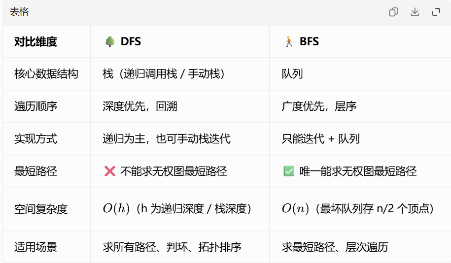

> 📚 前置依赖：图的基本概念、邻接矩阵 / 邻接表存储结构、递归与队列基本原理
> 
> 🎯 核心目标：掌握 DFS/BFS 核心逻辑、存储结构选择依据、关键代码细节，是所有图算法的基础！408 每年必考选择题 + 大题

---

### 📌 图的遍历本质

图的遍历是**从某顶点出发，访问所有顶点且仅访问一次**的过程。

- ⚠️ 图存在**环**，必须用**访问标记数组**避免重复遍历和死循环
- 🔍 两种经典遍历：
    
    - 🌳 **DFS（深度优先）**：一条路走到黑，走不通再回溯
    - 🚶 **BFS（广度优先）**：一层一层扩散，先近后远
    

---

## 🔑 核心问题：为什么 DFS/BFS 要选邻接表 / 邻接矩阵？

### ✨ 遍历算法的核心操作

**无论 DFS 还是 BFS，99% 的时间都花在同一件事上：获取当前顶点的所有邻接点**

- 每访问一个顶点，必须遍历它的全部邻接点，才能继续递归 / 入队
- 这个操作的时间复杂度，直接决定了整个遍历的总时间复杂度

### 🧮 邻接矩阵：适合稠密图

#### 存储特性

- 用二维数组`matrix[i][j]`表示顶点 i 到 j 的边
- 无论实际有多少条边，都要占用$O(n^2)$的空间

#### 遍历邻接点的代价

要找顶点 v 的所有邻接点，必须**遍历整行 n 个元素**，时间复杂度$O(n)$

- 不管 v 实际有 1 个邻接点还是 n-1 个邻接点，都要检查 n 次

#### 适用场景：稠密图（$e≈n^2$）

- 稠密图中，每个顶点的平均度 $dˉ(v)=\frac{2e}{n}​≈n$
- 此时邻接表遍历邻接点的代价也是$O(n)$，和邻接矩阵相同
- 但邻接矩阵实现更简单，没有指针开销，访问速度更快，所以优先选择

### 🔗 邻接表：适合稀疏图

#### 存储特性

- 每个顶点后面挂一个链表，只存它**实际存在的邻接点**
- 总空间复杂度$O(n+e)$，边越少越省空间

#### 遍历邻接点的代价

要找顶点 v 的所有邻接点，只需要**遍历它的链表**，时间复杂度$O(d(v))$

- $d(v)$是顶点 v 的实际度数，也就是它连的边数

#### 适用场景：稀疏图（$e≪n^2$）

- 稀疏图中，每个顶点的平均度$dˉ(v)≪n$
- 比如 1000 个顶点 1000 条边的图，平均每个顶点只有 2 个邻接点
- 邻接表遍历邻接点的代价是$O(1)$，比邻接矩阵的$O(1000)$快 1000 倍！

### 📊 性能对比实例


> 💡 408 考试技巧：题目中如果$n≤100$，用邻接矩阵；如果$n≥1000$，一定用邻接表

---

## 1. 🌳 深度优先遍历（DFS）

### ✨ 核心思想

递归 + 回溯：访问当前顶点→标记→递归访问任意一个未访问的邻接点→回溯

- 天然匹配 ** 栈（LIFO）** 特性，递归调用栈自动完成回溯

### 🔥 为什么 DFS 天然适合递归？

1. **递归本质是函数调用栈**：调用函数压栈，返回出栈，正好对应 DFS 的 "访问 - 回溯" 过程
2. **代码极简**：递归 DFS 核心只有 3 行，和算法描述完全一致
3. **逻辑直观**：递归的执行流程和 DFS 的思想完全同步，不容易写错

### ⚠️ 误区纠正：DFS 不是只能递归！

DFS 也可以用手动栈实现非递归版本，原理和递归完全一样，只是把操作系统的调用栈换成了我们自己定义的栈：

```cpp
void DFS_NonRecursive(int start_v) const {
    std::vector<bool> visited(vertex_count_, false);
    std::stack<int> s;
    s.push(start_v);
    visited[start_v] = true;
    
    while (!s.empty()) {
        int curr = s.top();
        s.pop();
        std::cout << vertex_list_[curr] << " ";
        
        // 注意：逆序压栈，保证访问顺序和递归一致
        for (int i = vertex_count_ - 1; i >= 0; i--) {
            if (matrix_[curr][i] != INF_ && !visited[i]) {
                visited[i] = true;
                s.push(i);
            }
        }
    }
}
```

💡 408 考试中，递归 DFS 是绝对重点，非递归 DFS 了解即可，几乎不考。

### ⏱️ 时间复杂度

- 邻接矩阵：$O(n^2)$（每个顶点遍历整行）
- 邻接表：$O(n+e)$（$每个顶点和每条边各访问一次）

### 🚀 拓展能力

- ✅ 判断连通性、求连通分量
- ✅ 求两点之间的所有路径（回溯时取消标记）
- ✅ 判断图中是否存在环
- ✅ 拓扑排序（有向无环图）

### 🧑‍💻 核心代码（保留关键注释）

```cpp
// 公有接口：处理非连通图
void AM::DFS() const {
    if (!vertex_list_) throw std::runtime_error("Graph not initialized.");
    
    // 访问标记数组：初始全为false（未访问）
    std::vector<bool> visited(vertex_count_, false);
    std::cout << "DFS Traversal:" << std::endl;
    
    // 遍历所有顶点：每个未访问的顶点都是一个新连通分量的起点
    for (int i = 0; i < vertex_count_; ++i) {
        if (!visited[i]) {
            DFSHelper(i, visited);
        }
    }
}

// 私有递归助手：DFS核心逻辑
void AM::DFSHelper(int start_v, std::vector<bool>& visited) const {
    // 1. 访问当前顶点
    std::cout << vertex_list_[start_v] << " ";
    // 2. 【关键】访问后立即标记为已访问！绝对不能放在递归之后
    visited[start_v] = true;
    
    // 3. 遍历所有邻接点，递归访问未访问的
    for (int i = 0; i < vertex_count_; i++) {
        // 存在边 且 未访问 → 递归
        if (matrix_[start_v][i] != INF_ && !visited[i]) {
            DFSHelper(i, visited);
        }
    }
}
```

---

## 2. 🚶 广度优先遍历（BFS）

### ✨ 核心思想

队列 + 层序：起点入队→出队访问→所有未访问邻接点入队→重复

- 天然匹配 ** 队列（FIFO）** 特性，先入队的顶点先被访问

### 🔥 为什么 BFS 不能用递归？

1. **数据结构矛盾**：BFS 要求先进先出（队列），而递归是后进先出（栈），本质完全相反
2. **硬写递归会有致命问题**：
    
    - 必须额外维护全局队列，递归只是替代 while 循环，完全失去意义
    - 递归深度等于队列长度，$1000$ 个顶点的图会直接栈溢出
    - 性能更差，可读性极差
    
3. **唯一正确实现**：迭代 + 队列

### ⏱️ 时间复杂度

和 DFS 完全相同：

- 邻接矩阵：$O(n^2)$
- 邻接表：$O(n+e)$

### 🚀 独家能力：求无权图最短路径

- 原理：BFS 按层遍历，第 $k$ 层顶点到起点的距离就是 $k$
- 第一次访问到某个顶点时，经过的路径一定是最短的
- DFS 做不到这一点，因为 DFS 可能先绕远路访问顶点

### 🧑‍💻 核心代码（保留关键注释）

```cpp
// 公有接口：处理非连通图，同时求最短路径
void AL::BFS() const {
    if (!vertex_list_) throw std::runtime_error("Graph not initialized.");
    
    // 状态容器：pair<是否访问, 到起点的最短距离>
    // 距离初始化为INF，表示不可达
    std::vector<std::pair<bool, int>> inf(vertex_count_, {false, INF_});
    std::cout << "BFS Traversal (with shortest path):" << std::endl;
    
    // 遍历所有顶点：处理每个连通分量
    for (int i = 0; i < vertex_count_; ++i) {
        if (!inf[i].first) {
            BFSHelper(i, inf);
        }
    }
}

// 私有助手：BFS核心逻辑，求无权图单源最短路径
void AL::BFSHelper(int start_v, std::vector<std::pair<bool, int>>& inf) const noexcept {
    std::queue<int> q;
    // 【关键】入队时立即标记为已访问！绝对不能放在出队时
    inf[start_v].first = true;
    inf[start_v].second = 0; // 起点到自己的距离是0
    q.push(start_v);
    
    while (!q.empty()) {
        // 1. 出队：取出队首顶点
        int curr = q.front();
        q.pop();
        
        // 2. 访问当前顶点，输出距离
        std::cout << std::format("{} (distance: {})", vertex_list_[curr].data_, inf[curr].second) << std::endl;
        
        // 3. 遍历所有邻接点
        Node* p = vertex_list_[curr].first_;
        while (p) {
            // 未访问 → 标记+更新距离+入队
            if (!inf[p->id_].first) {
                inf[p->id_].first = true;
                // 最短路径：父节点距离+1
                inf[p->id_].second = inf[curr].second + 1;
                q.push(p->id_);
            }
            p = p->next_;
        }
    }
}
```

---

## ⚔️ DFS vs BFS 核心对比



---

### 🎓 408 必考考点速记

1. **存储选择**：稠密图用邻接矩阵，稀疏图用邻接表（核心看 $e$ 和 $n²$ 的关系）
2. **标记时机**：DFS 访问后立即标记，BFS 入队时立即标记（否则会重复遍历）
3. **非连通图**：必须在外层套循环遍历所有顶点
4. **BFS 独家**：求无权图单源最短路径
5. **时间复杂度**：邻接矩阵$O(n^2)$，邻接表$O(n+e)$（DFS 和 BFS 相同）
6. **DFS 实现**：递归是标准写法，非递归了解即可

### ⚠️ 致命避坑

- ❌ DFS 标记放在递归后：会导致无限递归、栈溢出
- ❌ BFS 标记放在出队时：会导致同一个顶点多次入队，时间复杂度爆炸
- ❌ 非连通图只遍历一次：会漏掉其他连通分量的顶点
- ❌ 非递归 DFS 忘记逆序压栈：会导致访问顺序和递归版本不一致