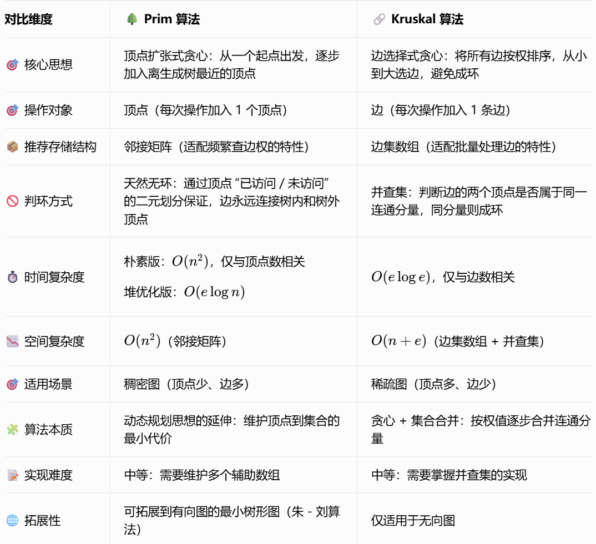

> 📚 前置依赖：邻接矩阵存储结构、最小生成树基本概念、贪心算法思想
> 
> 🎯 核心目标：掌握 Prim 算法的核心思想、实现细节、正确性证明，能够区分 Prim 与 Kruskal 的适用场景，覆盖 408 考试选择与大题全考点

---

## 📌 最小生成树核心回顾

### 🔍 什么是最小生成树

最小生成树（Minimum Spanning Tree, MST）：给定一个带权无向连通图（连通网），从所有生成树中筛选出**边权总和最小**的那一棵，即为该图的最小生成树。

> 💡 生成树基础性质回顾：
> 
> - 包含图中全部 n 个顶点，恰好有 n-1 条边
> - 是极小连通子图，任意去掉一条边都会变为非连通图
> - 任意添加一条边都会形成唯一的环
> - 一个图的生成树不唯一，最小生成树也可能不唯一，但**总权值一定唯一**

### 🧩 两大经典 MST 算法定位

1. **Kruskal 算法**：从**边**的角度出发，用贪心思想按边权从小到大选边，配合并查集判环，构造最小生成树
2. **Prim 算法**：从**顶点**的角度出发，逐步将顶点加入生成树，每次选择离生成树最近的顶点，通过维护顶点到生成树的最小边权构造 MST

### 🌐 最小生成树应用场景

最小生成树问题应用极其广泛，覆盖工程、通信、生物、计算机等多个领域：

- ✅ 基础工程应用：网线架设、道路铺设、电路布线（用最少的电线 / 道路连通所有节点，总造价最低）
    
    - 例：网络 G 表示 n 个城市之间的通信线路，顶点表示城市，边表示通信线路，边权表示线路长度 / 造价，求 MST 得到总代价最小的组网方案
    
- ✅ 通信编码：LDPC 纠错码的构造
- ✅ 图像处理：Renyi 熵图像配准
- ✅ 人工智能：实时脸部验证的显著特征提取、聚类算法（层次聚类的核心思想）
- ✅ 生物信息：减少蛋白质氨基酸序列测序的数据存储开销
- ✅ 物理模拟：湍流中粒子交互的局部性模拟
- ✅ 网络工程：以太网桥接的自动配置，避免网络中形成环路

---

## 🧠 Prim 算法核心思想详解

### ✨ 核心定位：加点式贪心构造

Prim 算法从**顶点扩张**的角度构造最小生成树：从一个初始顶点开始，像 “滚雪球” 一样，每次把离当前生成树最近的顶点加入树中，用 n-1 条边把所有 n 个顶点都连接进生成树。

### 🎯 核心关注点 1：顶点的二元划分

Prim 算法全程将图中顶点分为两类，用标记数组区分：

|类别|标记值|含义|
|---|---|---|
|1 类点|flag[x] = 1|已经加入到最小生成树中的顶点|
|2 类点|flag[x] = 0|还未加入到最小生成树中的顶点|

> 💡 无环保证：每次加入生成树的边，一定是连接 “1 类点（树内）” 和 “2 类点（树外）” 的边，也就是每条边都只会连接一个新顶点到生成树上，因此绝对不会形成环，最终得到的一定是树形结构。

### 🎯 核心关注点 2：顶点到生成树的距离

#### 定义

- **点 x 到生成树的距离**：顶点 x 与生成树中所有顶点之间存在的边的边权集合
- **点 x 到生成树的最小距离**：上述边权集合中的最小值，也就是顶点 x 连接到生成树的最小代价

#### 存储：dist 数组

用`dist[x] = w`表示：当前状态下，顶点 x 到生成树的最短距离为 w。

> ⚠️ 重要性质：随着生成树不断加入新顶点，顶点到生成树的最小距离**只可能变小，不可能变大**—— 因为新加入的顶点可能带来更短的连接路径。

### 📝 算法完整执行步骤

#### 初始化阶段

1. 所有顶点标记为未访问（`flag[i] = 0`）
2. 所有顶点到生成树的初始距离设为无穷大（`dist[i] = ∞`）
3. 任选一个顶点作为生成树的起点，将其距离设为 0（`dist[start] = 0`）

#### 迭代阶段（循环执行 n 次，加入 n 个顶点）

1. **贪心选点**：从所有未加入生成树的顶点中，选出`dist`值最小的顶点 p
2. **加入生成树**：将顶点 p 标记为已访问（`flag[p] = 1`），把对应的最小边加入 MST，累计总权值
3. **更新距离**：遍历顶点 p 的所有邻接顶点 j，如果 j 还未加入生成树，就用边 p-j 的权值更新 j 的 dist：`dist[j] = min(dist[j], weight(p,j))`

> 💡 直观理解：每次都用 “最便宜” 的方式，把一个新顶点拉进生成树里，全程保证生成树的总权值最小。

---

## ✅ Prim 算法正确性证明

Prim 算法的正确性基于图论中的**切割性质（Cut Property）**，我们通过该定理结合归纳法逐步证明：

### 📌 前置定理：切割性质

对于带权无向连通图的任意一个顶点切割（将顶点集合划分为两个不相交的非空子集 S 和 V-S），所有连接 S 和 V-S 的边中，**权值最小的那条边，一定属于某一棵最小生成树**。

### 📝 归纳法证明过程

1. **初始状态成立**
    
    初始时生成树 S 只有一个起点，此时 S 与 V-S 构成一个切割，Prim 选择的第一条边是连接 S 与外部的最小边，根据切割性质，这条边一定属于某棵 MST，初始状态满足最优性。
    
2. **归纳假设**
    
    假设经过 k 步后，生成树 S 包含 k 个顶点，且 S 中的所有边都属于某一棵最小生成树 T。
    
3. **归纳步骤**
    
    第 k+1 步，Prim 算法选出连接 S 和 V-S 的最小边 e，将对应顶点加入 S。
    
    根据切割性质，边 e 一定属于某棵最小生成树。
    
    若 e 已经在我们假设的 MST T 中，那么加入后 S 仍然是 T 的子集，最优性保持；
    
    若 e 不在 T 中，那么 T 中一定存在另一条连接 S 和 V-S 的边 e'，且`weight(e) ≤ weight(e')`，将 e 替换 e' 得到的新树总权值不会更大，仍然是最小生成树。
    
    因此加入边 e 后，S 仍然是某棵 MST 的子集，最优性保持。
    
4. **最终结论**
    
    经过 n-1 步后，S 包含所有 n 个顶点，得到的生成树就是图的最小生成树。
    

> 💡 补充：最优子结构性质
> 
> 最小生成树的任意一棵子树，都是对应顶点子集的最小生成树。这也是 Prim 算法能够通过逐步扩张得到全局最优解的核心基础。

---

## 🧑‍💻 Prim 算法完整代码实现

> 🔧 存储结构：邻接矩阵（适配 Prim 算法频繁查询边权的特性）
> 
> 📌 代码说明：原代码逻辑保持不变，仅优化注释突出数据结构核心语义

### 📦 模块 1：Prim 算法类定义

```cpp
#include "adjacency_matrix.h"
#include <iostream>
#include <vector>
#include <stdexcept>
#include <format>
#include <climits>

/*
 * 测试用例（1-based 顶点编号）
9 15
1 2 3 4 5 6 7 8 9
1 2 3
1 6 4
2 7 6
7 6 7
2 3 8
2 9 5
3 9 2
3 4 12
9 4 11
7 4 14
7 8 9
6 5 18
4 8 6
8 5 1
4 5 10
 */

namespace minimum_scanning_tree {
    class Prim {
    public:
        // 🛠️ 默认构造函数
        Prim() noexcept;
        // 🗑️ 析构函数
        ~Prim() noexcept;
        // 🚫 禁用拷贝构造与赋值，避免浅拷贝内存问题
        Prim(const Prim&) = delete;
        Prim& operator=(const Prim&) = delete;

        // 🧮 计算最小生成树，传入邻接矩阵图对象（只读引用保证不修改原图）
        void ComputeMST(const AM& graph);
        // 🖨️ 打印MST计算结果
        void PrintMST() const;

    private:
        // ⚙️ Prim算法核心实现
        void ComputeHelper(const AM& graph);
        // 🖨️ 打印辅助函数
        void PrintHelper() const;

        // 📦 存储MST的所有边
        std::vector<AM::Edge> mst_edges_;
        // ⚖️ MST的总边权值
        int total_weight_;
    };
```

### ⚙️ 模块 2：构造与析构实现

```cpp
    // ====================== 构造与析构 ======================
    Prim::Prim() noexcept :
        mst_edges_(),
        total_weight_(0) {
    }

    Prim::~Prim() noexcept {
        // 不持有图的所有权，仅清空自身结果数据
        mst_edges_.clear();
        total_weight_ = 0;
    }
```

### 🎯 模块 3：公有接口实现

```cpp
    // ====================== 公有接口 ======================
    void Prim::ComputeMST(const AM& graph) {
        // 🔄 重置上一次计算的结果，支持多次调用计算不同的图
        mst_edges_.clear();
        total_weight_ = 0;

        int vertex_cnt = graph.GetVertexCount();
        if (vertex_cnt <= 0) {
            throw std::invalid_argument("ComputeMST failed: graph has no valid vertices.");
        }

        // 🚀 调用核心算法执行计算
        ComputeHelper(graph);

        // ✅ 结果校验：连通图的MST一定恰好有n-1条边
        if (mst_edges_.size() != vertex_cnt - 1) {
            throw std::runtime_error("ComputeMST failed: graph is disconnected, cannot form MST.");
        }
    }

    void Prim::PrintMST() const {
        if (mst_edges_.empty()) {
            throw std::runtime_error("PrintMST failed: MST has not been computed yet.");
        }

        std::cout << "\n=== Minimum Spanning Tree (Prim Algorithm) ===" << std::endl;
        PrintHelper();
        std::cout << std::format("\nTotal weight of MST: {}", total_weight_) << std::endl;
    }
```

### 🧠 模块 4：核心算法实现

```cpp
    // ====================== 私有辅助：核心算法 ======================
    void Prim::ComputeHelper(const AM& graph) {
        int n = graph.GetVertexCount();
        const int INF = INT_MAX;

        // 📏 lowcost[i]：下标i的顶点到当前MST的最小边权（即dist数组）
        std::vector<int> lowcost(n, INF);
        // 🚩 visited[i]：下标i的顶点是否已加入MST（即flag数组）
        std::vector<bool> visited(n, false);
        // 🧭 parent[i]：下标i的顶点在MST中的前驱顶点下标，用于回溯生成树边
        std::vector<int> parent(n, -1);

        // 🎯 选第0个顶点作为MST的起始点
        int start_idx = 0;
        lowcost[start_idx] = 0;
        visited[start_idx] = true;
        // 初始化起点所有邻接顶点的lowcost值
        for (int i = 0; i < n; i++) {
            int weight = graph.GetWeightByIdx(start_idx, i);
            if (weight < lowcost[i]) {
                lowcost[i] = weight;
                parent[i] = start_idx;
            }
        }

        // 🔁 循环n-1次，向MST中加入剩余的n-1个顶点（共n-1条边）
        for (int i = 1; i < n; i++) {
            // 1. 🎯 贪心选择：找到离MST最近的未访问顶点u
            int min_cost = INF;
            int u_idx = -1;
            for (int j = 0; j < n; j++) {
                if (!visited[j] && lowcost[j] < min_cost) {
                    min_cost = lowcost[j];
                    u_idx = j;
                }
            }
            // 找不到有效顶点，说明图不连通，直接退出循环
            if (u_idx == -1) {
                break;
            }

            // 2. ✅ 将顶点u正式加入MST
            visited[u_idx] = true;
            total_weight_ += min_cost;

            // 📝 记录MST边：前驱顶点 <-> 当前顶点
            int u_vertex = graph.GetVertex(u_idx);
            int parent_vertex = graph.GetVertex(parent[u_idx]);
            mst_edges_.emplace_back(parent_vertex, u_vertex, min_cost);

            // 3. 🔄 更新所有未访问顶点到MST的最小距离
            for (int v_idx = 0; v_idx < n; v_idx++) {
                if (!visited[v_idx]) {
                    int weight = graph.GetWeightByIdx(u_idx, v_idx);
                    if (weight < lowcost[v_idx]) {
                        lowcost[v_idx] = weight;
                        parent[v_idx] = u_idx;
                    }
                }
            }
        }
    }
```

### 🖨️ 模块 5：打印与测试函数

```cpp
    // ====================== 私有辅助：打印 ======================
    void Prim::PrintHelper() const {
        for (const auto& edge : mst_edges_) {
            std::cout << std::format(
                "Edge: {} <-> {} , weight: {}",
                edge.GetU(), edge.GetV(), edge.GetWeight()
            ) << std::endl;
        }
    }

    // ====================== 测试函数 ======================
    void runTestPrim() {
        std::cout << "Prim Minimum Spanning Tree Test" << std::endl;
        try {
            int vertex_cnt, edge_cnt;
            std::cout << "Enter the number of the count of vertex and edge: ";
            if (!(std::cin >> vertex_cnt) || vertex_cnt <= 0 || !(std::cin >> edge_cnt) || edge_cnt <= 0) {
                throw std::invalid_argument("Invalid vertex or edge count.");
            }

            int vertices[105];
            std::cout << "Enter " << vertex_cnt << " vertices: ";
            for (int i = 0; i < vertex_cnt; i++) {
                std::cin >> vertices[i];
            }

            // 📦 构建邻接矩阵图
            AM graph;
            graph.BuildGraph(vertex_cnt, edge_cnt, vertices);

            // 🧮 Prim算法计算MST
            Prim prim;
            prim.ComputeMST(graph);

            // 🖨️ 打印结果
            prim.PrintMST();
        }
        catch (const std::exception& e) {
            std::cerr << "\nError: " << e.what() << std::endl;
        }
    }
}

int main18() {
    minimum_scanning_tree::runTestPrim();
    return 0;
}
```

---

## ⏱️ 时间与空间复杂度分析

### 📈 时间复杂度

基于邻接矩阵实现的 Prim 算法：

- 外层循环执行 n 次（加入 n 个顶点）
- 每次循环中，选最小顶点需要遍历 n 个顶点，更新距离也需要遍历 n 个顶点
- 总时间复杂度：$O(n^2)$，仅与顶点数 n 相关，与边数 e 无关

> 💡 拓展：基于邻接表 + 优先队列（堆优化）的 Prim 算法
> 
> 时间复杂度可以优化到$O(elogn)$，适合稀疏图，但 408 考试以邻接矩阵的朴素 Prim 为核心考点。

### 📉 空间复杂度

- 邻接矩阵存储图：$O(n^2)$
- 算法辅助数组（lowcost、visited、parent）：$O(n)$
- 总空间复杂度：$O(n^2)$

---

## ⚔️ Prim vs Kruskal 详细对比



> 💡 408 考试速记：
> 
> - 顶点少、边多选 Prim（稠密图）
> - 顶点多、边少选 Kruskal（稀疏图）
> - 时间复杂度：Prim 看 n，Kruskal 看 e

---

## 🎓 408 必考考点速记

1. **核心思想**：Prim 是顶点贪心，每次选离生成树最近的顶点加入
2. **存储适配**：邻接矩阵是 Prim 的经典存储结构，时间复杂度O(n2)
3. **数组含义**：lowcost 数组存顶点到生成树的最小边权，visited 数组标记是否加入 MST
4. **无环保证**：边永远连接树内和树外顶点，天然不会成环
5. **正确性基础**：切割性质 + 最优子结构
6. **适用场景**：稠密图优先用 Prim，稀疏图优先用 Kruskal
7. **结果性质**：MST 总权值唯一，边的选择可能不唯一

---

## ⚠️ 常见避坑技巧

1. ❌ 标记时机错误：顶点选中时就要标记为已访问，不能等处理完邻接点再标记，否则会重复加入
2. ❌ 初始化错误：起点的 lowcost 要设为 0，其余设为无穷大，不能全部初始化为 0
3. ❌ 混淆适用场景：稀疏图用邻接矩阵 Prim 会造成大量空间浪费和时间浪费
4. ❌ 忽略连通性：非连通图无法生成完整的 MST，代码中必须加入结果校验
5. ❌ 边权溢出：无穷大值要选择大于所有可能边权的数值，避免加法溢出

---

## 🧪 测试用例与运行结果

### 输入用例

```markdown
9 15
1 2 3 4 5 6 7 8 9
1 2 3
1 6 4
2 7 6
7 6 7
2 3 8
2 9 5
3 9 2
3 4 12
9 4 11
7 4 14
7 8 9
6 5 18
4 8 6
8 5 1
4 5 10
```

### 预期输出

```markdown
Prim Minimum Spanning Tree Test
Enter the number of the count of vertex and edge: 9 15
Enter 9 vertices: 1 2 3 4 5 6 7 8 9
Enter 15 edges...

=== Minimum Spanning Tree (Prim Algorithm) ===
Edge: 1 <-> 2 , weight: 3
Edge: 1 <-> 6 , weight: 4
Edge: 2 <-> 9 , weight: 5
Edge: 9 <-> 3 , weight: 2
Edge: 2 <-> 7 , weight: 6
Edge: 7 <-> 8 , weight: 9
Edge: 8 <-> 4 , weight: 6
Edge: 8 <-> 5 , weight: 1

Total weight of MST: 36
```

> 💡 验证：与 Kruskal 算法得到的总权值一致，说明两种算法都得到了正确的最小生成树。