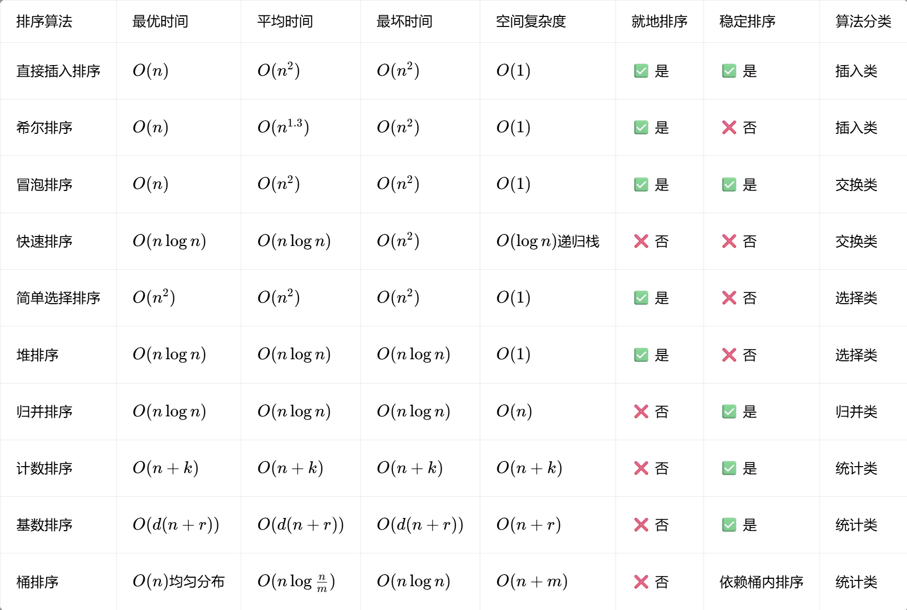

## 🏷️ 统计类排序总览📈

统计排序包含三类：**计数排序、基数排序、桶排序**，全部属于**非比较排序**，不依靠元素两两比较，通过数值统计、分桶、数位拆分实现线性 / 近线性时间复杂度，突破比较排序 $Ω(nlogn)$ 下界。

对应图片全部知识点：计数排序频次统计 + 前缀和、基数排序 LSD 逐位计数、桶排序分桶分组、时间复杂度推导式完整收录。

## 一、计数排序 CountingSort 🧮

### 1. 对应核心原理

1. 基础统计：引入 $`cnt`$ 计数数组，$`cnt[a[i]] = k`$ 代表数组存在 $k$ 个值为 a[i] 的元素；
2. 前缀和 $`sum`$ 稳定定位：
    
    - $sum[k]=cnt[1]+cnt[2]+⋯+cnt[k]$，$`sum[k]`$ 是最后一个值为 $k$ 的元素目标下标
    - 递推公式：$sum[i]=sum[i−1]+cnt[i]$
    
3. 逆序遍历原数组写入临时数组，保证相等元素相对顺序不变，实现稳定排序。

### 2. 特性

- 时间复杂度：$O(n+k)$，$k$ 为数值区间跨度
- 空间：$O(n+k)$，非就地、稳定排序
- 适用：整数、数值范围远小于数据量场景（分数、年龄）

### 3. C++ 源码

```cpp
/// 计数排序（标准稳定版，线性时间非比较排序📈，依托频次统计+前缀和确定元素最终位置）
export class CountingSort : public SortBase {
public:
    using SortBase::SortBase;
    void Sort() override;
};

void CountingSort::Sort() {
    int n = static_cast<int>(data_.size());
    if (n <= 1) {
        PrintStep(1);
        return;
    }

    // 1. 遍历数组，确定数值的最小值与最大值，划定计数统计的数值范围
    int min_val = data_[0];
    int max_val = data_[0];
    for (int num : data_) {
        min_val = std::min(min_val, num);
        max_val = std::max(max_val, num);
    }

    // 偏移量：将所有数值映射到从 0 开始的非负下标，拓展支持负数排序场景
    const int offset = -min_val;
    const int count_range = max_val - min_val + 1;

    // 2. 引入cnt计数数组：cnt[num+offset]存储对应数值出现的频次k，完成基础次数统计📊
    std::vector<int> count(count_range, 0);
    for (int num : data_) {
        ++count[num + offset];
    }

    // 3. 计算前缀和sum数组（复用count空间实现）：sum[k]代表最后一个值为k的元素的最终下标位置，递推公式sum[i]=sum[i-1]+cnt[i]
    // 前缀和是实现稳定排序、精准定位元素位置的核心逻辑
    for (int i = 1; i < count_range; ++i) {
        count[i] += count[i - 1];
    }

    // 4. 逆序遍历原数组，依托前缀和将元素写入临时数组
    // 逆序遍历可保留相等元素原本的先后顺序，维持排序稳定性
    std::vector<int> tmp(n);
    for (int i = n - 1; i >= 0; --i) {
        int num = data_[i];
        int idx = count[num + offset] - 1; // 前缀和减1得到当前元素的存放下标
        tmp[idx] = num;
        --count[num + offset]; // 同值元素的前缀计数递减，下一个相同元素往前放
    }

    // 5. 将排序完成的结果整体移回原数组
    data_ = std::move(tmp);

    // 计数排序为线性非比较排序，一轮统计+排布即可完成全量排序，仅输出最终结果
    PrintStep(1);
}
```

## 二、基数排序 RadixSort 🔢

### 1. 对应核心原理

1. 底层依赖**稳定计数排序**，采用 LSD 最低位优先规则：从个位 → 十位 → 百位…… 逐位排序；
2. 设数组最大值总位数为 $d$，十进制基数固定为 $10$；
3. 时间复杂度公式：$d⋅(n+10)$。

### 2. 特性

- 时间复杂度：$O(d(n+r))$，$d$ 最大位数，$r$ 基数（十进制 $r=10$）
- 空间：$O(n+r)$，非就地、稳定排序
- 适用：多位数整数、手机号、身份证号、超大数字

### 3. C++ 源码

```cpp
/// 基数排序（标准LSD最低位优先版🔢，以稳定计数排序为底层基础，从个位向高位逐位完成排序）
export class RadixSort : public SortBase {
public:
    using SortBase::SortBase;
    void Sort() override;

private:
    /// 按指定位权进行稳定计数排序（基数排序核心子过程）
    /// @param exp 位权：1=个位，10=十位，100=百位...；整体时间复杂度为d*(n+10)，d为待排数据最大数的总位数，10为十进制基数
    /// @param offset 负数偏移量，兼容负整数排序场景
    void countSortByDigit(int exp, int offset) noexcept;
};

void RadixSort::Sort() {
    int n = static_cast<int>(data_.size());

    // 1. 遍历找到数组最大值与最小值，确定最高位数，同时设置偏移兼容负数
    int min_val = data_[0], max_val = data_[0];
    for (int num : data_) {
        min_val = std::min(min_val, num);
        max_val = std::max(max_val, num);
    }
    int offset = -min_val;

    int step = 0;
    // 2. LSD最低位优先策略：从个位起步，向高位逐轮执行稳定计数排序
    // 总时间复杂度d*(n+10)，d是待排数据最大数的总位数，10为十进制基数的计数数组长度
    for (int exp = 1; (max_val + offset) / exp > 0; exp *= 10) {
        countSortByDigit(exp, offset);
        PrintStep(++step); // 每完成一位的排序处理，打印本轮排序结果
    }
}

void RadixSort::countSortByDigit(int exp, int offset) noexcept {
    int n = static_cast<int>(data_.size());
    const int radix = 10;       // 十进制基数，单个数位的取值范围固定为0~9
    std::vector<int> count(radix, 0);
    std::vector<int> tmp(n);

    // 1. 统计当前数位上0-9每个数字的出现频次
    for (int i = 0; i < n; ++i) {
        int digit = (data_[i] + offset) / exp % radix;
        ++count[digit];
    }

    // 2. 计算数位维度的前缀和，确定每个数位值对应的元素最终存放边界
    for (int i = 1; i < radix; ++i) {
        count[i] += count[i - 1];
    }

    // 3. 逆序遍历原数组，依托前缀和写入临时数组，保证排序稳定
    for (int i = n - 1; i >= 0; --i) {
        int digit = (data_[i] + offset) / exp % radix;
        tmp[count[digit] - 1] = data_[i];
        --count[digit];
    }

    // 4. 移动语义将排序结果写回原数组，避免额外拷贝开销
    data_ = std::move(tmp);
}
```

## 三、桶排序 BucketSort 🪣

### 1. 对应核心原理

1. 将 $n$ 个数据划分为 $m$ 个桶，**桶与桶之间天然有序**；
2. 每个桶内部独立排序，可选用任意排序算法（示例使用标准排序）；
3. 均分场景时间复杂度推导：
    
    每桶元素数量 $\frac{n}{m}$​，单桶归并开销 $\frac{n}{m}\log\frac{n}{m}$
    
    总开销：$m \cdot \left(\frac{n}{m} \log\frac{n}{m}\right) = n\log\left(\frac{n}{m}\right)$

### 2. 特性

- 平均时间 $O(n)$（数据均匀分布），最坏 $O(nlogn)$（全部数据落入同一桶）
- 空间：$O(n+m)$，非就地排序；稳定性由桶内排序算法决定
- 适用：均匀分布数值、浮点数、大范围离散数据

### 3. C++ 源码

```cpp
/// 桶排序（标准均匀分桶版🪣，分组保证组间天然有序，桶内可自由选用排序算法完成内部排序）
export class BucketSort : public SortBase {
public:
    using SortBase::SortBase;
    void Sort() override;

    /// 设置单个桶的数值区间大小，默认值为10；若均分m个桶、桶内用归并排序，总时间复杂度为m*(n/m * log(n/m)) = n*log(n/m)
    void SetBucketSize(int size) noexcept;

private:
    int bucket_size_ = 10; // 每个桶对应的数值区间跨度，控制分桶数量与分布
};  

void BucketSort::SetBucketSize(int size) noexcept {
    bucket_size_ = size > 0 ? size : 10; // 非法值兜底为默认大小
}

void BucketSort::Sort() {
    int n = static_cast<int>(data_.size());
    if (n <= 1) {
        PrintStep(1);
        return;
    }

    // 1. 遍历确定数据范围：最小值与最大值
    int min_val = data_[0];
    int max_val = data_[0];
    for (int num : data_) {
        min_val = std::min(min_val, num);
        max_val = std::max(max_val, num);
    }

    // 2. 计算桶的总数量，创建分桶
    // 公式：桶数量 = (最大值 - 最小值) / 桶区间大小 + 1，保证覆盖全部数值
    int bucket_count = (max_val - min_val) / bucket_size_ + 1;
    std::vector<std::vector<int>> buckets(bucket_count);

    // 3. 遍历原数组，将元素映射到对应桶中
    // 映射公式：桶下标 = (当前值 - 最小值) / 桶区间大小，天然支持负数
    for (int num : data_) {
        int bucket_idx = (num - min_val) / bucket_size_;
        buckets[bucket_idx].push_back(num);
    }

    // 4. 对每个桶内的元素分别排序，按桶顺序合并回原数组
    int idx = 0;
    for (auto& bucket : buckets) {
        // 桶内使用标准排序，若需稳定排序可替换为 std::stable_sort
        std::sort(bucket.begin(), bucket.end());
        // 按桶的顺序依次将元素放回原数组
        for (int num : bucket) {
            data_[idx++] = num;
        }
    }

    // 桶排序为单次分桶+合并流程，输出最终排序结果
    PrintStep(1);
}
```

---

# 附录：十大排序算法总对比表 📊

对应枚举 `SortType` 全部 10 类排序：

`StraightInsertion、Shell、Bubble、Quick、Selection、Heap、Merge、Counting、Radix、Bucket`



## 十大排序一句话核心逻辑总结✨

1. **直接插入排序**：依次把无序元素插入前方有序区间，适合小规模有序数据。
2. **希尔排序**：分组插入排序，不断缩小步长，大幅减少元素移动次数。
3. **冒泡排序**：相邻元素两两比较交换，每轮把最大值上浮到无序区末尾。
4. **快速排序**：选取基准值分区，分治递归处理左右子区间，综合性能最优。
5. **简单选择排序**：每轮遍历无序区找到最小值，交换至有序区尾部，交换次数极少。
6. **堆排序**：构建大顶堆，反复交换堆顶最大值至数组尾部，下沉恢复堆结构。
7. **归并排序**：二分递归拆分数组，双指针合并两个有序子序列，稳定且复杂度稳定。
8. **计数排序**：统计数值出现频次 + 前缀和定位下标，窄区间整数线性稳定排序。
9. **基数排序**：从个位到高位逐轮执行稳定计数排序，适配长编号、大整数。
10. **桶排序**：按数值区间分桶保证桶间有序，桶内排序后顺序合并，均匀分布数据效率极高。