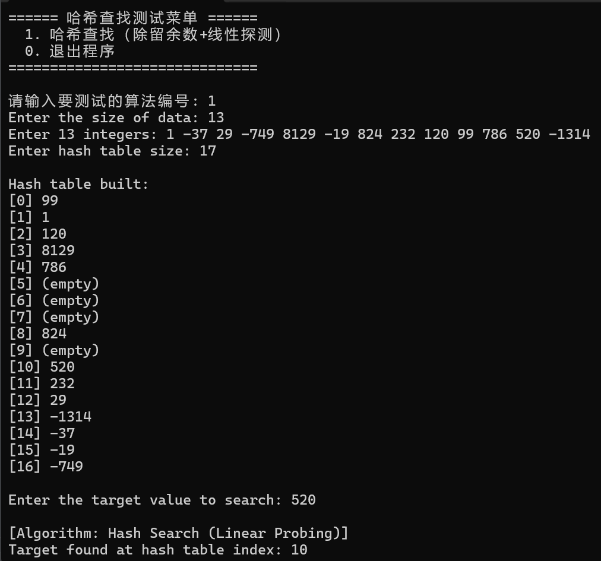

## 开篇定位：和传统查找的本质区别📌

之前学习的顺序、折半、分块查找，**都依赖关键字多次比较逐步缩小查找范围**；

哈希查找跳出了比较逻辑：通过预设的哈希函数，直接建立「数据关键字 → 存储地址」的数学映射，理想情况下仅 $1$ 次寻址就能完成查找。

---

## 一、哈希基础核心概念

1. **哈希查找前置要求**
    
    先根据选定的哈希函数、冲突解决策略构建完整哈希表，后续所有插入、查找操作都在哈希表上执行。
2. **哈希冲突**
    
    不同关键字经同一个哈希函数计算得到相同存储地址的现象；**冲突无法彻底消除，只能通过优化方案尽可能降低发生概率**。
3. **装填因子（负载因子）**
    
    核心效率指标：$$\lambda=\frac{n}{m}$$​

- $n$：哈希表中已存入的元素个数
- $m$：哈希表总长度
    
    $λ$ 越接近 $1$，表内空闲位置越少，冲突概率越高，查找效率下降越明显。

---

## 二、4 类常用哈希函数构造方法🔧

### 1. 直接定址法

公式：$H(key)=a\cdot key + b$（为固定常数）

直接用关键字的线性结果作为存储地址。

✅优点：实现极简，无冲突；❌缺点：关键字分布零散时会产生大量空位，空间浪费严重。

### 2. 除留余数法（本次代码采用，工程最常用）

公式：$H(key)=key \% p$

规则：p选取**不大于表长 $m$ 、最接近 $m$ 的质数**，可最大程度弱化冲突；代码额外做了负数兼容优化：$H(key)=(key\%m + m)\%m$，保证输出下标始终合法非负。

### 3. 数字分析法

适用场景：关键字为多位数、数位分布有规律

规则：观察所有关键字各位数字的分散程度，选取分布均匀的若干位作为哈希地址。

例：$81346532$ 选取末尾分布分散的两位 $46$ 作为地址。

### 4. 平方取中法

规则：将关键字做平方运算，截取结果中间若干位作为哈希地址。

例：$4212=177241$，截取中间两位 $72$ 作为地址。

---

## 三、哈希冲突的两大类解决策略🛠️

### 大类 1：开放定址法（冲突后在哈希表内部寻找新空位，通用公式 $H_i=(H(key)+d_i)\%m$，$di​$ 为增量序列，$m$ 为表长）

1. **线性探测法（本次代码采用）**
    
    增量序列 $d_i=1,2,3,\dots,m-1$，冲突时向后逐个寻址，到达表尾则循环回到表头。
    
    ✅优点：实现最简单；❌缺点：容易产生数据堆积（聚集），连续占用位置会加剧后续冲突，拉低整体效率。
2. **平方探测法**
    
    增量 $d_i​=1^2,−1^2,2^2,−2^2…k^2,−k^2$，要求表长 $m$ 满足 $m=4k+3$，至少可探测一半表空间，能有效缓解堆积现象。
1. **双散列法**
    
    增量 $d_i​=i×H_2​(key)$，用第二个独立哈希函数生成增量，探测分布最均匀，堆积效应最弱。
1. **伪随机法**
    
    di​使用提前生成的伪随机序列，随机性强，可弱化聚集问题。

### 大类 2：链地址法（拉链法）

规则：哈希表每个位置存储链表头节点，所有产生冲突的关键字都插入该位置的链表中。

✅优点：支持动态扩容，彻底解决堆积问题；❌缺点：需要额外的链表内存开销，小数据场景内存利用率偏低。

---

## 四、影响哈希查找效率的 3 个关键因素

1. 哈希函数的选取：能让关键字均匀分布的哈希函数，可大幅减少初始冲突
2. 冲突解决策略：不同方案的堆积程度差异大，直接决定平均查找长度
3. 装填因子 $λ$：$λ$ 越大，表内空闲空间越少，冲突概率呈陡增趋势

---

## 五、经典例题完整演算📝

### 题目条件

关键字序列：$(7,8,30,11,18,9,14)$

哈希函数：$H(key)=(key\times3)\%7$，冲突用线性探测法，装填因子 $λ=0.7$

推导表长：$λ=\frac{n}{m}​=\frac{7}{m}​=0.7⟹m=10$，哈希表下标范围 $0∼9$

### (1) 哈希表逐元素构建

|关键字|初始哈希地址|冲突探测过程|最终存储下标|
|---|---|---|---|
|7|(7×3)%7=0|无冲突|0|
|8|(8×3)%7=3|无冲突|3|
|30|(30×3)%7=6|无冲突|6|
|11|(11×3)%7=5|无冲突|5|
|18|(18×3)%7=5|5、6 被占用，探测到 7 空位|7|
|9|(9×3)%7=6|6、7 被占用，探测到 8 空位|8|
|14|(14×3)%7=0|0 被占用，探测到 1 空位|1|

最终哈希表结果：

|i|0|1|2|3|4|5|6|7|8|9|
|---|---|---|---|---|---|---|---|---|---|---|
|hash[i]|7|14|空|8|空|11|30|18|9|空|

### (2) 等概率 ASL（平均查找长度）计算

#### 查找成功 ASL

统计每个关键字命中需要的比较次数：

$$\text{ASL}_{成功}=\frac{1+2+1+1+1+3+3}{7}=\frac{12}{7}$$

#### 查找失败 ASL

统计哈希模 7 共 7 种初始地址的失败探测次数：

$$\text{ASL}_{失败}=\frac{3+2+1+2+1+5+4}{7}=\frac{18}{7}$$

---

## 六、C++ 完整实现详解💻

### 架构说明

基于 C++20 Module 标准开发，封装`HashSearch`类，采用**除留余数哈希 + 线性探测冲突方案**，支持负数关键字、重复元素去重、满表异常保护，配套交互式测试菜单。

### 完整代码

```cpp
// 模块声明部分
export module hash_search;
import <vector>;

namespace hash_search {

    // ==============================================================
    // 哈希查找（除留余数法 + 线性探测法）
    // 哈希函数：H(key) = key % 表长
    // 冲突解决：线性探测向后寻址，循环遍历哈希表
    // ==============================================================
    export class HashSearch {
    public:
        /// 构造函数：传入原始数据与哈希表长度，自动构建哈希表
        /// @param arr 原始待查找数据
        /// @param table_size 哈希表总长度，建议取大于数据量的质数
        explicit HashSearch(std::vector<int> arr, int table_size);
        ~HashSearch() = default;

        /// 哈希查找：返回目标值在哈希表中的下标，未找到返回 -1
        int Search(int target) const;

        /// 获取原始数据只读引用
        [[nodiscard]] const std::vector<int>& GetOriginalData() const noexcept;
        /// 获取构建完成的哈希表只读引用
        [[nodiscard]] const std::vector<int>& GetHashTable() const noexcept;

    private:
        /// 哈希函数：除留余数法，兼容负数输入
        int hash(int key) const noexcept;

        std::vector<int> original_data_; ///< 原始数据副本
        std::vector<int> hash_table_;    ///< 哈希表数组
        int table_size_;                 ///< 哈希表总长度
        static constexpr int EMPTY_FLAG = INT_MIN; ///< 空位置标记值
    };

    /// 统一测试入口函数
    export void runTest();

} // namespace hash_search

// 模块实现部分
module;
#include <iostream>
#include <vector>
#include <stdexcept>
#include <format>
#include <climits>

module hash_search;

namespace hash_search {

    // ====================== 私有工具函数 ======================
    int HashSearch::hash(int key) const noexcept {
        // 除留余数法：key % 表长，双重取模保证负数也输出非负下标
        return (key % table_size_ + table_size_) % table_size_;
    }

    // ====================== 构造与建表 ======================
    HashSearch::HashSearch(std::vector<int> arr, int table_size)
        : original_data_(std::move(arr)), table_size_(table_size) {
        if (table_size <= 0) {
            throw std::invalid_argument("Hash table size must be a positive integer.");
        }

        // 初始化哈希表，所有位置填充空标记
        hash_table_.resize(table_size_, EMPTY_FLAG);

        // 逐个插入元素，线性探测解决冲突
        for (int key : original_data_) {
            int idx = hash(key);
            int start = idx; // 记录起始位置，防止满表死循环

            // 线性探测：当前位置被占用则向后找空位
            while (hash_table_[idx] != EMPTY_FLAG) {
                if (hash_table_[idx] == key) {
                    break; // 重复元素不重复插入，直接跳过
                }
                idx = (idx + 1) % table_size_; // 循环探测，避免数组越界

                // 回到起始位置，说明哈希表已满
                if (idx == start) {
                    throw std::runtime_error("Hash table is full, failed to insert all elements.");
                }
            }

            hash_table_[idx] = key;
        }
    }

    // ====================== 查找核心实现 ======================
    int HashSearch::Search(int target) const {
        int idx = hash(target);
        int start = idx; // 记录起始位置，防止满表死循环

        // 从哈希地址开始线性探测
        while (hash_table_[idx] != EMPTY_FLAG) {
            if (hash_table_[idx] == target) {
                return idx; // 命中目标，返回哈希表下标
            }
            idx = (idx + 1) % table_size_;

            // 遍历完整个表回到起点，判定未找到
            if (idx == start) {
                break;
            }
        }

        return -1; // 查找失败
    }

    // ====================== 只读接口实现 ======================
    const std::vector<int>& HashSearch::GetOriginalData() const noexcept {
        return original_data_;
    }

    const std::vector<int>& HashSearch::GetHashTable() const noexcept {
        return hash_table_;
    }

    // ====================== 统一测试入口 ======================
    void runTest() {
        try {
            // 1. 读取并校验数据量
            int n;
            std::cout << std::format("Enter the size of data: ");
            if (!(std::cin >> n) || n <= 0) {
                throw std::invalid_argument("Invalid data size: must be positive integer.");
            }

            // 2. 读取原始数据
            std::vector<int> arr(n);
            std::cout << std::format("Enter {} integers: ", n);
            for (int i = 0; i < n; ++i) {
                if (!(std::cin >> arr[i])) {
                    throw std::invalid_argument("Invalid input: please enter integers.");
                }
            }

            // 3. 读取哈希表长度
            int table_size;
            std::cout << "Enter hash table size: ";
            if (!(std::cin >> table_size) || table_size <= 0) {
                throw std::invalid_argument("Invalid table size: must be positive integer.");
            }

            // 4. 构建哈希表
            HashSearch hs(std::move(arr), table_size);

            // 5. 打印哈希表结构
            std::cout << "\nHash table built:\n";
            const auto& table = hs.GetHashTable();
            for (int i = 0; i < table_size; ++i) {
                if (table[i] == INT_MIN) {
                    std::cout << std::format("[{}] (empty)\n", i);
                }
                else {
                    std::cout << std::format("[{}] {}\n", i, table[i]);
                }
            }

            // 6. 读取查找目标
            int target;
            std::cout << "\nEnter the target value to search: ";
            if (!(std::cin >> target)) {
                throw std::invalid_argument("Invalid target value.");
            }

            // 7. 执行查找并输出结果
            int result = hs.Search(target);
            std::cout << "\n[Algorithm: Hash Search (Linear Probing)]\n";
            if (result != -1) {
                std::cout << std::format("Target found at hash table index: {}\n", result);
            }
            else {
                std::cout << "Target not found in the hash table.\n";
            }

        }
        catch (const std::exception& e) {
            std::cerr << std::format("\nError: {}\n", e.what());
        }
    }

} // namespace hash_search

// 主程序入口
import hash_search;
#include <iostream>
#include <limits>

int main() {
    std::cout << "====== 哈希查找测试菜单 ======\n";
    std::cout << "  1. 哈希查找（除留余数+线性探测）\n";
    std::cout << "  0. 退出程序\n";
    std::cout << "==============================\n";

    int choice;
    while (true) {
        std::cout << "\n请输入要测试的算法编号: ";
        // 处理非数字输入，避免死循环
        if (!(std::cin >> choice)) {
            std::cout << "输入无效，请输入数字！\n";
            std::cin.clear();
            std::cin.ignore(std::numeric_limits<std::streamsize>::max(), '\n');
            continue;
        }

        if (choice == 0) {
            std::cout << "退出测试程序\n";
            break;
        }

        if (choice != 1) {
            std::cout << "编号超出范围，请输入 0 或 1\n";
            continue;
        }

        // 调用哈希查找测试
        hash_search::runTest();
    }

    return 0;
}
```

### 核心逻辑亮点

1. 负数兼容哈希算法，覆盖正负整数场景
2. 插入阶段自动去重，避免重复数据冗余
3. 循环探测设置起点保护，防止哈希表满时死循环
4. 完善异常捕获，对非法输入、表满场景做容错处理

---

## 七、程序运行演示专区📸

### 操作流程

1. 编译运行程序，在主菜单输入`1`进入哈希测试流程
2. 依次输入数据规模、原始整数序列、哈希表长度
3. 程序自动打印完整哈希表，输入待查找关键字即可得到寻址结果



---

## 八、哈希查找优缺点总结✨

✅ 优势

1. 理想场景单次寻址完成查找，查询效率远优于传统比较类查找
2. 插入、删除仅需局部寻址修改，动态数据维护成本低
    
❌ 局限
1. 冲突无法完全避免，装填因子升高后效率会明显下滑
2. 仅支持精准等值查找，无法实现范围检索、排序类查询